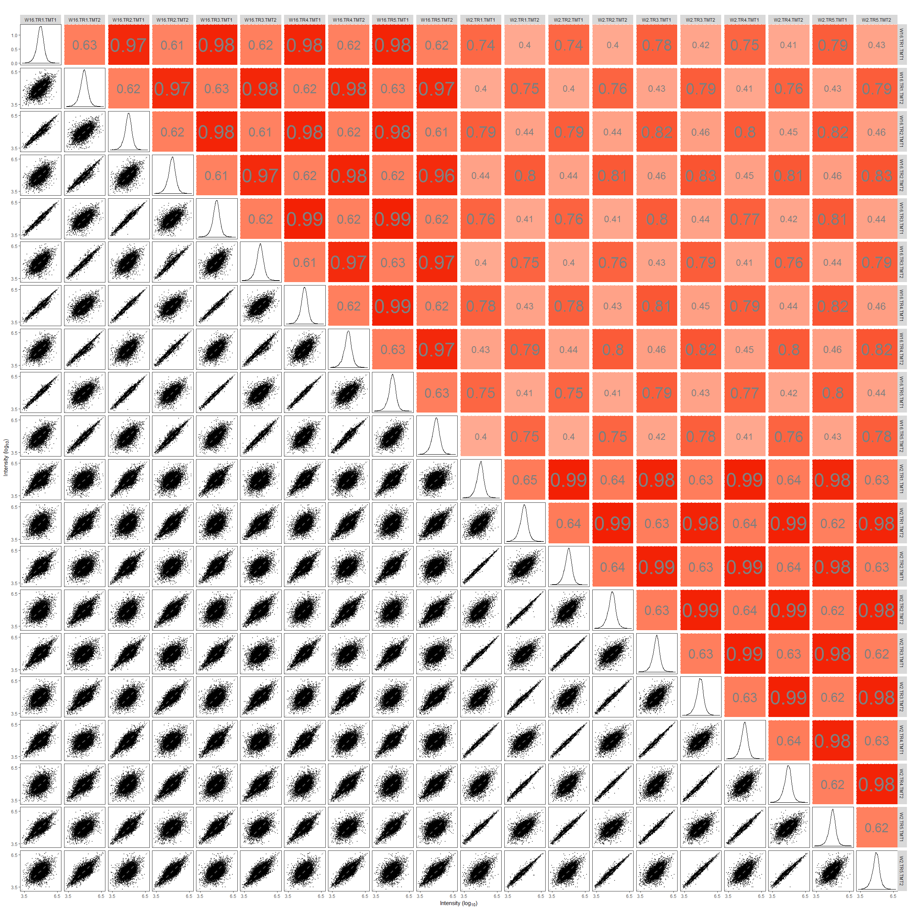
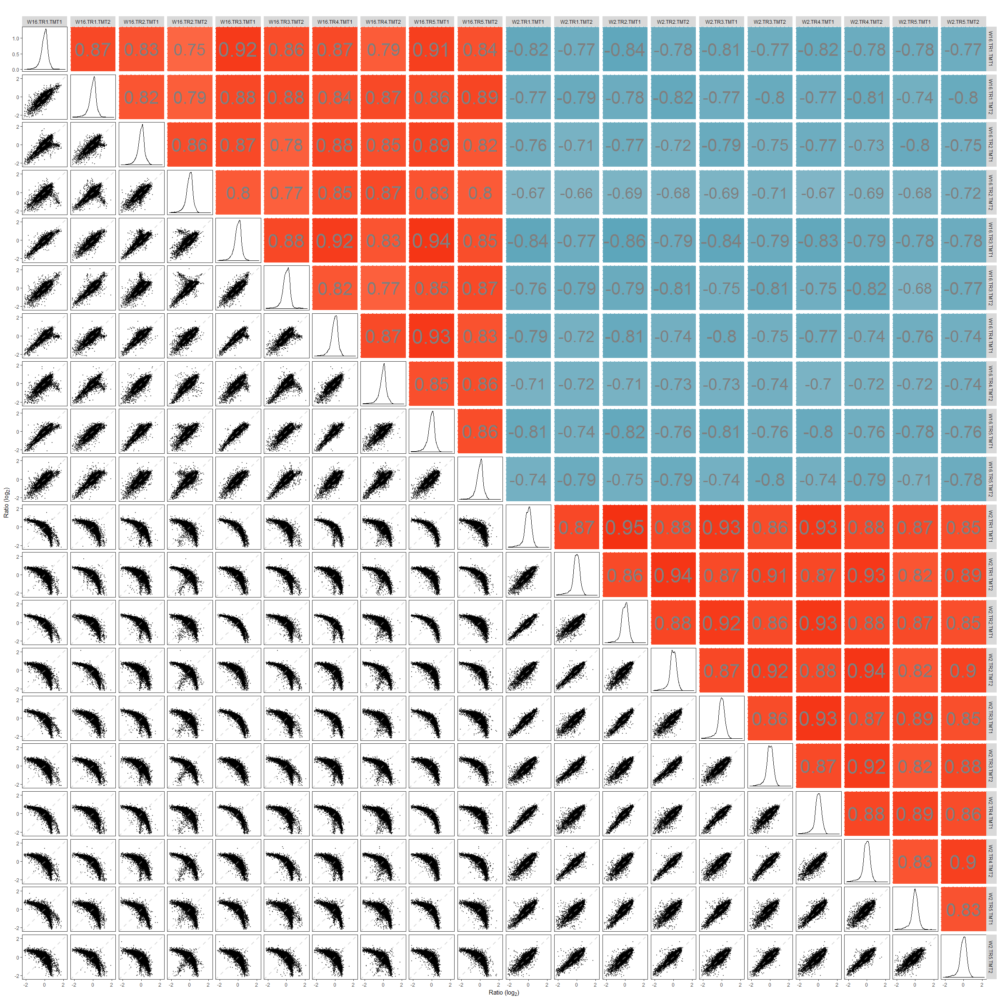

# proteoQ
Process TMT data from tandem MS experiments

## Introduction to proteoQ
Chemical labeling using tandem mass tag ([TMT](https://en.wikipedia.org/wiki/Tandem_mass_tag)) has been commonly applied in mass spectrometry (MS)-based quantification of proteins and peptides. The proteoQ tool currently processes the peptide spectrum matches (PSM) tables from [Mascot](https://http://www.matrixscience.com/) searches for 6-, 10- or 11-plex TMT experiments. Peptide and protein results are then produced with users' selection of parameters in data filtration, alignment and normalization. The package further offers a suite of tools and functionalities in statistics, informatics and data visualization by creating 'wrappers' around published R functions. 

## Installation
To install this package, run R (version "3.6") as administrator and enter:

```{r installation_1, include = TRUE, eval = FALSE}
if (!requireNamespace("BiocManager", quietly = TRUE))
    install.packages("BiocManager")
BiocManager::install(c("Biobase", "GSVA", "Mfuzz", "NMF", "gage", "limma"))

if (!requireNamespace("devtools", quietly = TRUE))
    install.packages("devtools")
devtools::install_github("qzhang503/proteoQ")
```

## Application  
In this section I illustrate the following applications of `proteoQ`:

* Summarization of PSM data to peptide and protein reports.
* Basic informatic analysis with the peptide and protein data.

### Set up the experiments

```{r setting_1, include = TRUE, eval = FALSE}
# Load the proteoQ library
library(proteoQ)

# Set up the working directory
dat_dir <- "c:\\The\\First\\Example"
```

PSM table(s) in a `csv` format will be exported by the users from the [Mascot](https://http://www.matrixscience.com/) search engine. I typically set the option of `Include sub-set protein hits` to `0` with my opinionated choice in using the principle of parsimony. The options of `Header` and `Peptide quantitation` should be checked to include the search parameters and quantitative values. The `filename(s)` of the export(s) will be taken as is.  

It is possible for the same peptide sequence under different PSM files being assigned to different protein IDs when [inferring](https://www.ncbi.nlm.nih.gov/m/pubmed/21447708/) proteins from peptides. To avoid such ambiguity in protein inference, I typically enable the option of `Merge MS/MS files into single search` in [Mascot Daemon](http://www.matrixscience.com/daemon.html). If the option is disabled, peptide sequences that have been assigned to multiple protein IDs will be removed when constructing peptide reports. 

The pacakge reads an `Excel` template containing the information of multiplex experiment numbers, TMT channels, LC/MS injection indices, sample IDs and corresponding RAW data file names. The default file name for the experimental summary is `expt_smry.xlsx`. If samples were fractionated off-line prior to `LC/MS`, a second `Excel` template will also be filled out to link multiple `RAW` file names that are associated to the same sample IDs. The default file name for the fractionation summary is `frac_smry.xlsx`. 

The above files should be stored immediately under the the file folder specified by `dat_dir`. Examples of PSM outputs, `expt_smry` and `frac_smry` can be found as the follows:

```{r setting_2, include = TRUE, eval = FALSE}
system.file("extdata", "F012345.csv", package = "proteoQ")
system.file("extdata", "expt_smry.xlsx", package = "proteoQ")
system.file("extdata", "frac_smry.xlsx", package = "proteoQ")
```


The description of the column keys in the `Excel` files can be found from the following: 

```{r load_expts, include = TRUE, eval = FALSE}
?load_expts
```


As a final step of the setup, we will load the experimental summary and some precomputed results:

```{r setting_3, include = TRUE, eval = FALSE}
# Load the experiment
load_expts()
```


### Summarize PSMs to peptides and proteins 

*Process PSMs* --- In this section, I demonstrate my approach of summarising PSM data to peptides and proteins. We start by processing PSM data from `Mascot` outputs:  

```{r PSM summary, eval = FALSE}
# Generate PSM reports
normPSM(
 rptr_intco = 1000,
 rm_craps = FALSE,
 rm_krts = FALSE,
 rm_outliers = FALSE,
 plot_violins = TRUE
)

# or accept the default in parameters 
normPSM()
```

PSM outliers will be assessed at a basis of per peptide and per sample at `rm_outliers = TRUE`, which can be a slower process for large data sets. To mitigate repeated efforts in the assessment of PSM outliers, we may set `rm_outliers = FALSE` and `plot_violins = TRUE` when first executing `normPSM()`. We then visually inspect the violin plots of reporter-ion intensity. Empirically, PSMs with reporter-ion intensity less than 1,000 are trimmed and  samples with median intensity that is 2/3 or less to the average of majority samples are removed from further analysis.  

*Summarize PSMs to peptides* --- We next summarise PSM to peptides.  

```{r PSM to peptides, eval = FALSE}
# Generate peptide reports
normPep(
 id = pep_seq_mod,
 method_align = MGKernel,
 n_comp = 2,
 range_log2r = c(20, 95),
 range_int = c(5, 95)
)

# or accept the default setting
normPep()
```

At `id = pep_seq_mod`, peptide sequences that are different in variable modificaitons will be treated as different species. I often choose this setting when analyzing phosphopeptides where the localization of site modifications may be an interest. 

By default, the log2FC of peptide data will be aligned by median centering across samples. If `method_align = MGKernel` is chosen, log2FC will be aligned under the assumption of multiple Gaussian kernels. The parameter `n_comp` defines the number of Gaussian kernels. The parameters `range_log2r` and `range_int` define the range of log2FC and the range of reporter-ion intensity, respectively, for use in the scaling normalization of standard deviation across samples. 

Let's inspect the log2FC profiles with and without scaling normalization: 

```{r Peptide log2FC, eval = FALSE}
# without the scaling of log2FC 
pepHist(
 scale_log2r = FALSE, 
 show_curves = TRUE,
 show_vline = TRUE,
 ncol = 5
)

# with the scaling of log2FC 
pepHist(
 scale_log2r = TRUE, 
 show_curves = TRUE,
 show_vline = TRUE,
 ncol = 5
)
```

Without scaling normalization             |  With scaling normalization
:-------------------------:|:-------------------------:
 |   

As expected, the widths of log2FC profiles become closer to each other after the scaling normalization. However, it is worthwhile to note that such adjustment may sometime lead to the shrinkage of log2FC towards zero. In the example shown below, `Smpl_6` contains a group of proteins that are largely abscent in `samples 1 - 5`. As shown, the scaling of log2FC would probably have obsecured the measures of relative protein abundance in `Smpl_6`. Having have this in my mind, I typically test `scale_log2r` at both `TRUE` and `FALSE`, then make a choice in data scaling together with my a priori knowledge of the sample origins. 

Without scaling normalization             |  With scaling normalization
:-------------------------:|:-------------------------:
 |   

Alignment of log2FC against housekeeping or normalizer protein(s) is also available. This seems suitable when the quantities of proteins of interest are different across samples where the assumption of constitutive expression for the vast majority of proteins may not hold.  
*Summarize peptides to proteins* --- We then summarise peptides to proteins.  

```{r Protein reports, eval = FALSE}
# Generate protein reports
normPrn(
 id = gene,
 method_pep_prn = median,
 method_align = MGKernel,
 range_log2r = c(20, 90),
 range_int = c(5, 95),
 n_comp = 2,
 seed = 246, 
 maxit = 200,
 epsilon = 1e-05
)
```

Similar to the peptide summary, we check the alignment and the scaling of ratio profiles, and re-normalize the data when needed.  

```{r Protein log2FC without scaling, eval = FALSE}
# without the scaling of log2FC
prnHist(
 scale_log2r = FALSE, 
 show_curves = TRUE,
 show_vline = TRUE,
 ncol = 5
)

# with the scaling of log2FC
prnHist(
 scale_log2r = TRUE, 
 show_curves = TRUE,
 show_vline = TRUE,
 ncol = 5
)
```

### Correlation plots
The documentation after this point is under construction... Correlations of both intensity and log2FC will be performed.

```{r Peptide corr, eval = FALSE}
# Correlation plots of peptide data
pepCorr(
	use_log10 = TRUE, 
	scale_log2r = TRUE, 
	min_int = 3.5,
	max_int = 6.5, 
	min_log2r = -2, 
	max_log2r = 2, 
	width = 24,
	height = 24
)
```


```{r Protein corr, eval = FALSE}
# Correlation plots of protein data
prnCorr(
	use_log10 = TRUE, 
	scale_log2r = TRUE, 
	min_int = 3.5,
	max_int = 6.5, 
	min_log2r = -2, 
	max_log2r = 2,
	width = 24,
	height = 24		
)
```

{ width=45% } 
{ width=45% }

The following shows examples of MDS and PCA against peptide data:

```{r Peptide MDS, eval = FALSE}
# MDS plots of peptide data
pepMDS(
  scale_log2r = TRUE,
  col_color = Color,
  col_shape = Shape,
  show_ids = TRUE,
)

pepPCA(
  scale_log2r = TRUE,
  col_color = Color,
  col_shape = Shape,
  show_ids = TRUE,
)
```


