proteoQ
================
true
2020-07-02

  - [Introduction to proteoQ](#introduction-to-proteoq)
  - [Installation](#installation)
  - [1 Data normalization](#data-normalization)
      - [1.1 Experiment setup](#experiment-setup)
      - [1.2 PSM summarization](#psm-summarization)
      - [1.3 PSMs to peptides](#psms-to-peptides)
      - [1.4 Peptides to proteins](#peptides-to-proteins)
      - [1.5 Workflow scripts](#workflow-scripts)
      - [1.6 Quick start](#quick-start)
  - [2 Basic informatics](#basic-informatics)
      - [2.1 MDS](#mds)
      - [2.2 PCA](#pca)
      - [2.3 LDA](#lda)
      - [2.4 Correlation plots](#correlation-plots)
      - [2.5 Heat maps](#heat-maps)
      - [2.6 Significance tests](#significance-tests)
      - [2.7 Gene sets under volcano
        plots](#gene-sets-under-volcano-plots)
      - [2.8 Gene set networks](#gene-set-networks)
      - [2.9 Trend Analysis](#trend-analysis)
      - [2.10 NMF Analysis](#nmf-analysis)
      - [2.11 STRING Analysis](#string-analysis)
      - [2.12 Missing value imputation](#missing-value-imputation)
  - [3 Labs](#labs)
      - [3.1 Reference choices](#reference-choices)
      - [3.2 Data subsets and additions](#data-subsets-and-additions)
      - [3.3 Random effects](#random-effects)
  - [4 Column keys](#column-keys)
      - [4.1 Mascot](#mascot)
      - [4.2 MaxQuant](#maxquant)
  - [References](#references)

## Introduction to proteoQ

Chemical labeling using tandem mass tag
([TMT](https://en.wikipedia.org/wiki/Tandem_mass_tag)) has been commonly
applied in mass spectrometry (MS)-based quantification of proteins and
peptides. The `proteoQ` tool is designed for automated and reproducible
analysis of proteomics data. It interacts with an `Excel` spread sheet
for dynamic sample selections, aesthetics controls and statistical
modelings. It further integrates the operations against data rows and
columns into functions at the users’ interface. The arrangements allow
users to put *ad hoc* manipulation of data behind the scene and instead
apply metadata to openly address biological questions using various data
preprocessing and informatic tools. In addition, the entire workflow is
documented and can be conveniently reproduced upon revisiting.

The [framework](https://proteoq.netlify.app/post/how-do-i-run-proteoq/)
of `proteoQ` consists of data processing and informatics analysis. It
first processes the peptide spectrum matches (PSM) tables from
[Mascot](https://http://www.matrixscience.com/),
[MaxQuant](https://www.maxquant.org/) and [Spectrum
Mill](https://www.agilent.com/en/products/software-informatics/masshunter-suite/masshunter-for-life-science-research/spectrum-mill)
searches, for 6-, 10- 11- or 16-plex TMT experiments using Thermo’s
Orbitrap mass analyzers. Peptide and protein results are then produced
with users’ selection of parameters in data filtration, alignment and
normalization. The package further offers a suite of tools and
functionalities in statistics, informatics and data visualization by
creating ‘wrappers’ around published R routines.\[1\]

(Click <strong>[Recent
Posts](https://proteoq.netlify.com/#posts)</strong> for additional
examples.)

(Click
<strong>[here](https://htmlpreview.github.io/?https://github.com/qzhang503/proteoQ/blob/master/README.html)</strong>
to render a html version of the README. Mathematical symbols may display
more properly under html.)

## Installation

To install this package, start R (version “4.0”) and enter:\[2\]

``` r
if (!requireNamespace("devtools", quietly = TRUE))
    install.packages("devtools")
devtools::install_github("qzhang503/proteoQ")
```

## 1 Data normalization

In this document, I (Qiang Zhang) first illustrate the following
applications of `proteoQ`:

  - Summarization of PSM results to normalized peptide and protein data.
  - Visualization of quality metrics in normalized peptide and protein
    data.
  - Re-normalization of data against selected samples.
  - Mixed-bed normalization using full or partial data.
  - Removal of low-quality entries from PSM, peptide and protein data.

The data set we will use in this section corresponds to the proteomics
data from Mertins et al. (2018). In the study, two different breast
cancer subtypes, triple negative (WHIM2) and luminal (WHIM16), from
patient-derived xenograft (PDX) models were assessed by three
independent laboratories. At each site, lysates from WHIM2 and WHIM16
were each split and labeled with 10-plex TMT at equal sample sizes and
repeated on a different day. This results in a total of 60 samples
labeled under six 10-plex TMT experiments. The samples under each
10-plex TMT were fractionated by off-line, high pH reversed-phase
(Hp-RP) chromatography, followed by LC/MS analysis. The MS data were
analyzed against the search engines of
[Mascot](https://http://www.matrixscience.com/),
[MaxQuant](https://www.maxquant.org/) and [Spectrum
Mill](https://www.agilent.com/en/products/software-informatics/masshunter-suite/masshunter-for-life-science-research/spectrum-mill).
Ten percent of the PSM entries were sampled randomly from the complete
data sets and stored in a companion package, `proteoQDA`.

### 1.1 Experiment setup

The data packages, `proteoQDA`, should have been made available through
the `proteoQ` installation.\[3\]

#### 1.1.1 Fasta databases

RefSeq databases of human and mouse were used in the MS/MS searches
against the WHIM data sets. To properly annotate protein entries with
`proteoQ`, we would need the fasta file(s) that were used in the
database searches.\[4\] In the example below, we copy over the
corresponding fasta files from the `proteoQDA` to a database folder:

``` r
library(proteoQDA)
copy_refseq_hs("~/proteoQ/dbs/fasta/refseq")
copy_refseq_mm("~/proteoQ/dbs/fasta/refseq")
```

#### 1.1.2 PSM data

The data processing begins with PSM table(s) from Mascot, MaxQuant or
Spectrum Mill with the following compilation in file names:

  - Mascot: begin with letter `F`, followed by digits and ends with
    `.csv`;
  - MaxQuant: start with `msms` and end with `.txt`;
  - Spectrum Mill: start with `PSMexport` and end with `.ssv`.

The corresponding PSMs are available through one of the followings
`copy_` utilities:

``` r
# Mascot
copy_global_mascot()

# or MaxQuant
copy_global_maxquant()

# or Spectrum Mill
copy_global_sm()
```

To illustrate, I copy over Mascot PSMs to a working directory,
`dat_dir`:

``` r
dat_dir <- "~/proteoQ/examples"
dir.create(dat_dir, recursive = TRUE, showWarnings = FALSE)
copy_global_mascot(dat_dir)
```

When exporting Mascot PSMs, I typically set the option of `Include
sub-set protein hits` to `0` with my opinionated choice in satisfying
the principle of parsimony. If the option is set to `1`, the sub-set
proteins will be remove during PSM processing. Analogous handling of
redundancy will take place with `Include same-set protein hits` being
checked.


Under `Search Information`, the options of `Header` and `Search
parameters` should be checked to include information such as database(s)
and assumptions in the modifications of amino acid residues.


Under `Peptide Match Information`, the inclusion of both `Start` and
`End` is recommended and the `Peptide quantitation` is required.


In the events of phosphopeptide analyses, the confidence in the variable
modification sites can be incorporated into proteoQ reports by checking
the `Raw peptide match data` under `Query level information`.


The same peptide sequence under different PSM files can be assigned to
different protein IDs when
[inferring](https://www.ncbi.nlm.nih.gov/m/pubmed/21447708/) proteins
from peptides using algorithms such as greedy set cover. To escape from
the ambiguity in protein inference, I typically enable the option of
`Merge MS/MS files into single search` in [Mascot
Daemon](http://www.matrixscience.com/daemon.html).\[5\] If the option is
disabled, peptide sequences that have been assigned to multiple protein
IDs will be simply ascribed to the protein with the greatest number of
identifying peptides, when possible.


The merged search may become increasingly cumbersome with growing data
sets. In this example, I combined the MS peak lists from the Hp-RP
fractions within the same 10-plex TMT experiment, but not the lists
across experiments. This results in a total of six pieces of PSM results
in `Mascot` exports.

#### 1.1.3 Metadata

The workflow involves an `Excel` template containing the metadata of
multiplex experiments, including experiment numbers, TMT channels, LC/MS
injection indices, sample IDs, reference channels, `RAW` MS data file
names and additional fields from users. The default file name for the
experimental summary is `expt_smry.xlsx`. If samples were fractionated
off-line prior to `LC/MS`, a second `Excel` template will also be filled
out to link multiple `RAW` MS file names that are associated to the same
sample IDs. The default file name for the fractionation summary is
`frac_smry.xlsx`.\[6\] Unless otherwise mentioned, we will assume these
default file names throughout the document.

Columns in the `expt_smry.xlsx` are approximately divided into the
following three tiers: (1) `essential`, (2) `optional default` and (3)
`optional open`. We supply the required information of the TMT
experiments under the essential columns. The optional default columns
serve as the fields for convenient lookups in sample selection,
grouping, ordering, aesthetics etc. For instance, the program will by
default look for values under the `Color` column if no instruction was
given in the color coding of a PCA plot. The optional open fields on the
other hand allow us to define our own analysis and aesthetics. For
instance, we may openly define multiple columns of contrasts at
different levels of granularity for uses in statistical modelings.
Description of the column keys can be found from the help document by
entering `?proteoQ::load_expts` from a `R` console.


We next copy over a pre-compiled `expt_smry.xlsx` and a `frac_smry.xlsx`
to the working directory:

``` r
copy_global_exptsmry(dat_dir)
copy_global_fracsmry(dat_dir)
```

We now have all the pieces that are required by `proteoQ` in place.
Let’s have a quick glance at the `expt_smry.xlsx` file. We note that
no reference channels were indicated under the column `Reference`. With
`proteoQ`, the `log2FC` of each species in a given sample is calculated
either (*a*) in relative to the reference(s) within each multiplex TMT
experiment or (*b*) to the mean of all samples in the same experiment if
reference(s) are absent. Hence, the later approach will be employed to
the exemplary data set that we are working with. In this special case,
the `mean(log2FC)` for a given species in each TMT experiment is
averaged from five `WHIM2` and five `WHIM16` aliquots, which are
biologically equivalent across TMT experiments.

#### 1.1.4 Experiment upload

As a final step of the setup, we will load the experimental summary into
a work space:

``` r
library(proteoQ)
load_expts("~/proteoQ/examples")
```

### 1.2 PSM summarization

PSMs are MS/MS events that lead to peptide identification at certain
confidence levels. The evidences in PSMs can then be summarized to
peptide and protein findings using various descriptive statistics. In
this section, we will apply `proteoQ` to summarize PSM data into peptide
and protein reports.

#### 1.2.1 normPSM

We start the section by processing the PSM files exported directly from
`Mascot` searches:

``` r
# columns keys in PSM files suitable for varargs of `filter_`
normPSM(
  group_psm_by = pep_seq_mod, 
  group_pep_by = gene, 
  fasta = c("~/proteoQ/dbs/fasta/refseq/refseq_hs_2013_07.fasta", 
            "~/proteoQ/dbs/fasta/refseq/refseq_mm_2013_07.fasta"), 
  rptr_intco = 1000,
  rm_craps = TRUE,
  rm_krts = FALSE,
  rm_outliers = FALSE, 
  annot_kinases = TRUE, 
  plot_rptr_int = TRUE, 
  plot_log2FC_cv = TRUE, 
  
  filter_psms = exprs(pep_expect <= .1, pep_score >= 15), 
  filter_more_psms = exprs(pep_rank == 1),
)
```

At `group_psm_by = pep_seq`, PSM entries with the same primary peptide
sequence but different variable modifications will be grouped for
analysis using descriptive statistics. In case `group_psm_by =
pep_seq_mod`, PSMs will be grouped alternatively according to the unique
combination of the primary sequences and the variable modifications of
peptides. Analogously, `group_pep_by` specify the grouping of peptides
by either protein accession names or gene names. The `fasta` argument
points to the location of a copy of the RefSeq fasta files that were
used in the corresponding MS/MS searches. Additional options include
`rm_craps`, `rm_krts`, `annot_kinases` etc. More description of
`normPSM` can be found by accessing its help document via `?normPSM`.

Every time the `normPSM` module is executed, it will process the PSM
data from the ground up. In other words, it has no memory on prior
happenings. For instance, after inspecting graphically the intensity
distributions of reporter ions at `plot_rptr_int = TRUE`, we may
consider a more inclusive cut-off at `rptr_intco = 100`. The downward in
`rptr_intco` is *not* going to cause information loss in the range of
100 to 1,000. This is trivia but worth mentioning here. As we will find
out in following sections, utilities in peptide and protein
normalization, `standPep` and `standPrn`, do pass information onto
successive iterations.

#### 1.2.2 Outlier samples

For experiments that are proximate in the quantities of input materials,
there might still be unprecedented events that could have caused dipping
in the ranges of reporter-ion intensity for certain samples. With proper
justification, we might consider excluding the outlier samples from
further analysis. The sample removal and PSM re-processing can be
achieved by simply deleting the corresponding entries under the column
`Sample_ID` in `expt_smry.xlsx`, followed by the re-execution of
`normPSM()`.

#### 1.2.3 Outlier data entries

There is a subtle problem when we choose to remove PSM outliers at
`rm_outliers = TRUE`. Note that PSM outliers will be assessed at a
per-peptide-and-per-sample basis, which can be a slow process for large
data sets. To circumvent repeated efforts in finding PSM outliers, we
may initially set `rm_outliers = FALSE` and `plot_rptr_int = TRUE` when
executing `normPSM()`. This will allow us to first decide on an ultimate
threshold of reporter-ion intensity, before proceeding to the more
time-consuming procedure in PSM outlier removals.

#### 1.2.4 Variable arguments

The `normPSM` function can take additional, user-defined arguments of
`dot-dot-dot` (see Wickham 2019, ch. 6) for the row filtration of data
using logical conditions. In the above example, we have limited
ourselves to PSM entries with `pep_expect <= 0.1` and `pep_score >= 15`
by supplying the variable argument (vararg) of `filter_psms_at`. We
further filtered the data at `pep_rank == 1` with another vararg of
`filter_psms_more`. It makes no difference whether we put the conditions
in one or multiple statements:

``` r
normPSM(
  filter_psms_at = exprs(pep_expect <= .1, pep_score >= 15, pep_rank == 1), 
  ..., 
)
```

The creation and assignment of varargs need to follow a format of
`filter_blahblah = exprs(cdn1, cdn2, ..., cdn_last)`. Note that the
names of varargs on the lhs start with the character string of `filter_`
to indicate the task of data filtration. On the rhs, `pep_expect`,
`pep_score` and `pep_rank` are column keys that can be found from the
Mascot PSM data. Backticks will be needed for column keys containing
white space(s) and/or special character(s): `` `key with space (sample
id in parenthesis)` ``. Analogously, we can apply the `vararg` approach
to MaxQuant and Spectrum Mill PSMs:

``` r
# `PEP` and `Mass analyzer` are column keys in MaxQuant PSM tables
normPSM(
  filter_psms_at = exprs(PEP <= 0.1, `Mass analyzer` == "FTMS"), 
  ..., 
)

# `score` is a column key in Spectrum Mill PSM tables
normPSM(
  filter_psms_at = exprs(score >= 10), 
  ..., 
)
```

I am new to `R`. It looks like that canonical `R` does not support the
straight assignment of logical expressions to function arguments. To get
around this, I took advantage of the facility of non-standard evaluation
in `rlang` package in that the logical conditions are supplied within
the round parenthesis after `exprs`. Next, the `proteoQ` program will
obtain the expression(s) on the rhs of each vararg statement by
performing a bare evaluation using `rlang::eval_bare`. Following that, a
tidy evaluation by `rlang::eval_tidy` will be coupled to a local
facility in `proteoQ` to do the real work of data filtrations ((see
Wickham 2019, ch. 20)).

The approach of data filtration taken by `normPSM` might at first looks
strange; however, it allows me to perform data filtration in a
integrated way. As mentioned in the beginning, a central theme of
`proteoQ` is to reduce or avoid direct data manipulations but utilizes
metadata to control both data columns and rows. With the
self-containedness in data filtration (and data ordering later), I can
readily recall and reproduce what I had done when revisiting the system
after an extended peroid. Otherwise, I would likely need *ad hoc*
operations by mouse clicks or writing ephemeral R scripts, and soon
forget what I have done.

Moreover, the build-in approach can serve as building blocks for more
complex data processing. As shown in the help documents via `?standPep`
and `?standPrn`, we can readily perform mixed-bed normalization by
sample groups, against either full or partial data.

#### 1.2.5 Vararg choices

With `normPSM`, we can pretty much `filter_` data under any PSM columns
we like. In the above Mascot example, I have chosen to filter PSM
entires by their `pep_expect`, `pep_score` etc. There is a reason for
this.

Let’s first consider a different column `pep_len`. The values underneath
are unique to both PSMs and peptides. As you might courteously agree,
*its time has not yet come* in terms of tentative data filtration by
peptide length. In other words, we can delay the filtration of peptide
entries by their sequence lengths when we are actually working with
peptide data. The summarization of PSMs to peptides is not going to
change the number of amino acid residues in peptides. By contrast, the
data under `pep_expect` are unique to PSMs, but not necessary to
peptides. This is obvious in that each of the PSM events of the same
peptide is likely to have its own confidence expectation in peptide
identification. Therefore, if we were to filter data by their
`pep_expect` values at a later stage of analysis, we would have lost the
authentic information in `pep_expect` for peptides with multiple PSM
identifications. More specifically, the values under `pep_expect` in
peptide tables are the geometric-mean representation of PSM results (see
also section 4).

For this reason, I named the varargs `filter_psms_at` and
`filter_psms_more` in the above `normPSM` examples. This allows me to
readily recall that I was filtering data based on criteria that are
specific to PSMs.

#### 1.2.6 Varargs and data files

Vararg statements of `filter_` and `arrange_` are available in proteoQ
for flexible filtration and ordering of data rows. To take advantage of
the feature, we need to be aware of the column keys in input files. As
indicated by their names, `filter_` and `filter2_` perform row
filtration against column keys from a primary data file, `df`, and
secondary data file(s), `df2`, respectively. The same correspondence is
applicable for `arrange_` and `arrange2_` varargs.

Users will typically employ either primary or secondary vararg
statements, but not both. In the more extreme case of `gspaMap(...)`, it
links `prnGSPA(...)` findings in `df2` to the significance p-values and
abundance fold changes in `df` for volcano plot visualizaitons by gene
sets. The table below summarizes the `df` and the `df2` for varargs in
`proteoQ`.

| Utility          | Vararg\_            | df                                                                  | Vararg2\_ | df2                                             |
| :--------------- | :------------------ | :------------------------------------------------------------------ | :-------- | :---------------------------------------------- |
| normPSM          | filter\_            | Mascot, F\[…\].csv; MaxQuant, msms\[…\].txt; SM, PSMexport\[…\].ssv | NA        | NA                                              |
| PSM2Pep          | NA                  | NA                                                                  | NA        | NA                                              |
| mergePep         | filter\_            | TMTset1\_LCMSinj1\_Peptide\_N.txt                                   | NA        | NA                                              |
| standPep         | slice\_             | Peptide.txt                                                         | NA        | NA                                              |
| Pep2Prn          | filter\_            | Peptide.txt                                                         | NA        | NA                                              |
| standPrn         | slice\_             | Protein.txt                                                         | NA        | NA                                              |
| pepHist          | filter\_            | Peptide.txt                                                         | NA        | NA                                              |
| prnHist          | filter\_            | Protein.txt                                                         | NA        | NA                                              |
| pepSig           | filter\_            | Peptide\[\_impNA\].txt                                              | NA        | NA                                              |
| prnSig           | filter\_            | Protein\[\_impNA\].txt                                              | NA        | NA                                              |
| pepMDS           | filter\_            | Peptide\[\_impNA\]\[\_pVal\].txt                                    | NA        | NA                                              |
| prnMDS           | filter\_            | Protein\[\_impNA\]\[\_pVal\].txt                                    | NA        | NA                                              |
| pepPCA           | filter\_            | Peptide\[\_impNA\]\[\_pVal\].txt                                    | NA        | NA                                              |
| prnPCA           | filter\_            | Protein\[\_impNA\]\[\_pVal\].txt                                    | NA        | NA                                              |
| pepEucDist       | filter\_            | Peptide\[\_impNA\]\[\_pVal\].txt                                    | NA        | NA                                              |
| prnEucDist       | filter\_            | Protein\[\_impNA\]\[\_pVal\].txt                                    | NA        | NA                                              |
| pepCorr\_logFC   | filter\_            | Peptide\[\_impNA\]\[\_pVal\].txt                                    | NA        | NA                                              |
| prnCorr\_logFC   | filter\_            | Protein\[\_impNA\]\[\_pVal\].txt                                    | NA        | NA                                              |
| pepHM            | filter\_, arrange\_ | Peptide\[\_impNA\]\[\_pVal\].txt                                    | NA        | NA                                              |
| prnHM            | filter\_, arrange\_ | Protein\[\_impNA\]\[\_pVal\].txt                                    | NA        | NA                                              |
| anal\_prnTrend   | filter\_            | Protein\[\_impNA\]\[\_pVal\].txt                                    | NA        | NA                                              |
| plot\_prnTrend   | NA                  | NA                                                                  | filter2\_ | \[…\]Protein\_Trend\_{NZ}\[\_impNA\]\[…\].txt   |
| anal\_pepNMF     | filter\_            | Peptide\[\_impNA\]\[\_pVal\].txt                                    | NA        | NA                                              |
| anal\_prnNMF     | filter\_            | Protein\[\_impNA\]\[\_pVal\].txt                                    | NA        | NA                                              |
| plot\_pepNMFCon  | NA                  | NA                                                                  | filter2\_ | \[…\]Peptide\_NMF\[…\]\_consensus.txt           |
| plot\_prnNMFCon  | NA                  | NA                                                                  | filter2\_ | \[…\]Protein\_NMF\[…\]\_consensus.txt           |
| plot\_pepNMFCoef | NA                  | NA                                                                  | filter2\_ | \[…\]Peptide\_NMF\[…\]\_coef.txt                |
| plot\_prnNMFCoef | NA                  | NA                                                                  | filter2\_ | \[…\]Protein\_NMF\[…\]\_coef.txt                |
| plot\_metaNMF    | filter\_, arrange\_ | Protein\[\_impNA\]\[\_pVal\].txt                                    | NA        | NA                                              |
| prnGSPA          | filter\_            | Protein\[\_impNA\]\_pVals.txt                                       | NA        | NA                                              |
| prnGSPAHM        | NA                  | NA                                                                  | filter2\_ | \[…\]Protein\_GSPA\_{NZ}\[\_impNA\]\_essmap.txt |
| gspaMap          | filter\_            | Protein\[\_impNA\]\_pVal.txt                                        | filter2\_ | \[…\]Protein\_GSPA\_{NZ}\[\_impNA\].txt         |
| anal\_prnString  | filter\_            | Protein\[\_impNA\]\[\_pVals\].txt                                   | NA        | NA                                              |

#### 1.2.7 purgePSM

To finish our discussion of PSM processing, let us consider having one
more bash in data cleanup. The corresponding utility is `purgePSM`. It
performs data purging by the CV of peptides, measured from contributing
PSMs within the same sample. Namely, quantitations that have yielded
peptide CV greater than a user-supplied cut-off will be replaced with
NA.

The `purgePSM` utility reads files `\PSM\TMTset1_LCMSinj1_PSM_N.txt`,
`TMTset1_LCMSinj2_PSM_N.txt` etc. from a preceding step of `normPSM`. To
revert programmatically the changes made by `purgePSM`, we would need to
start over with `normPSM`. Alternatively, we may make a temporary copy
of these files for a probable undo.

This process takes place sample (column)-wisely while holding the places
for data points that have been nullified. It is different to the above
row filtration processes by `filter_` in that there is no *row removals*
with purging, not until all-NA rows are encountered.

Earlier in section 1.2.1, we have set `plot_log2FC_cv = TRUE` by default
when calling `normPSM`. This will plot the distributions of the CV of
peptide log2FC. In the event of `plot_log2FC_cv = FALSE`, we can have a
second chance in visualizing the distributions of peptide CV before any
permanent data nullification:

``` r
purgePSM ()
```

Taking the sample entries under `TMT_Set` one and `LCMS_Injection` one
in `label_scheme.xlsx` as an example, we can see that a small portion of
peptides have CV greater than 0.5 at log2 scale (**Figure 1A**).

<div class="figure" style="text-align: center">

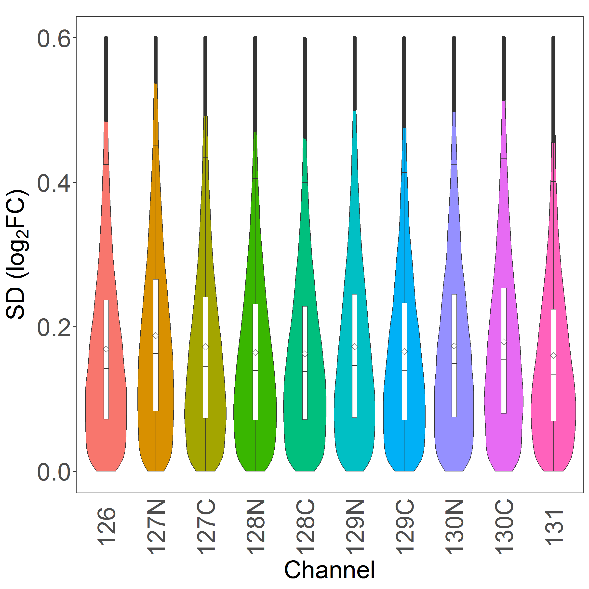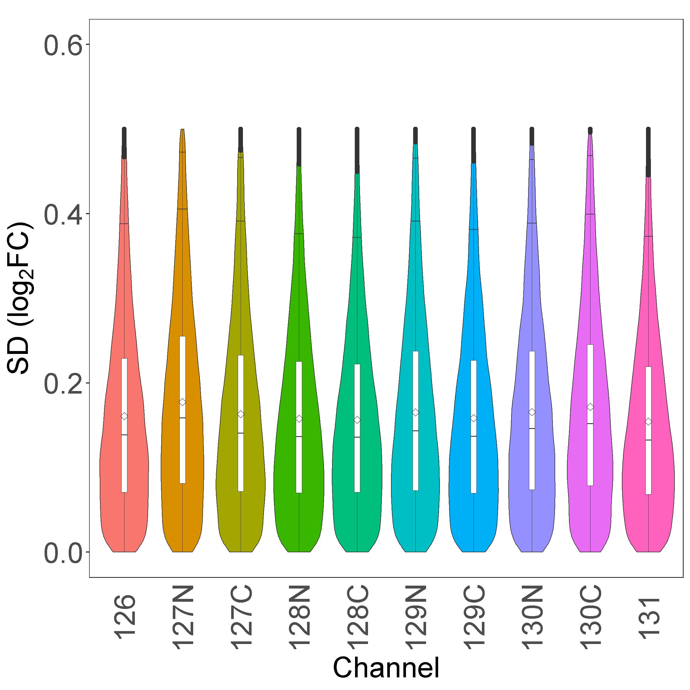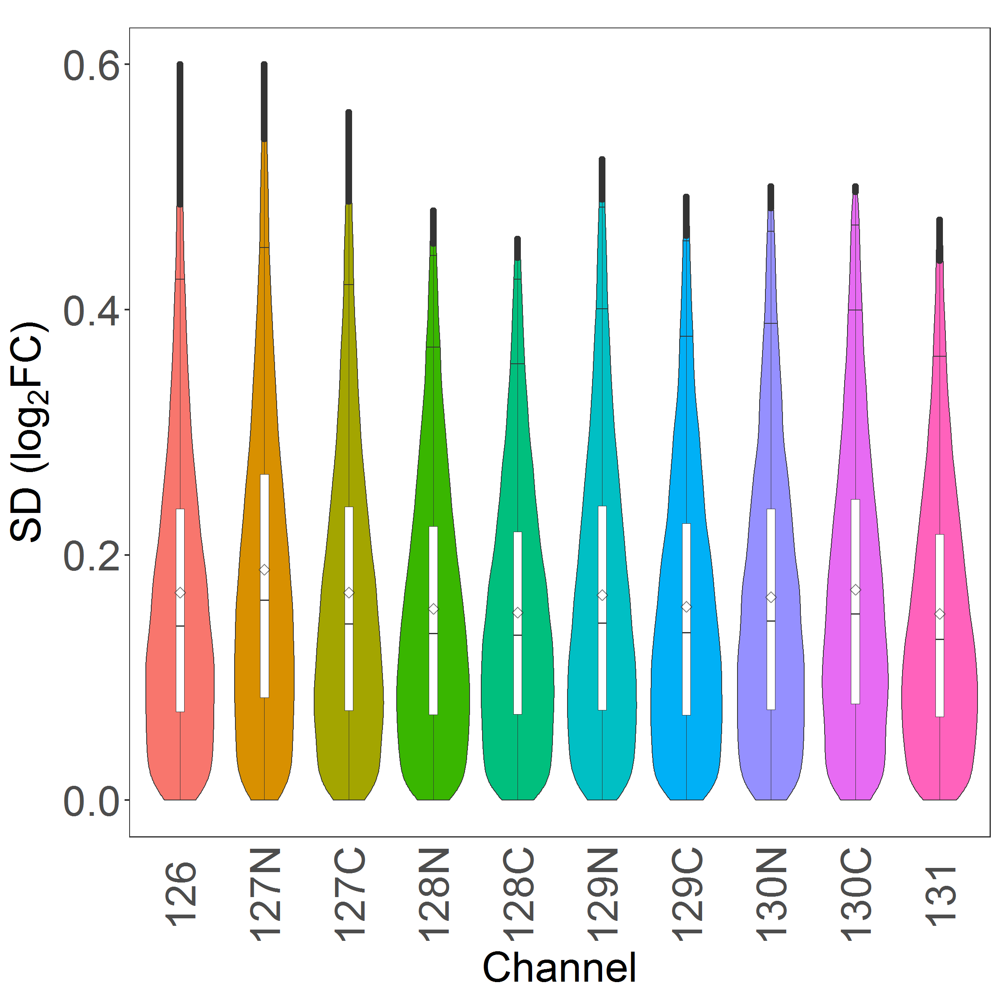

<p class="caption">

**Figure 1A-1C.** CV of peptide log2FC (based on full data set). Left:
no CV cut-off; middle: CV cut-off at 0.5; right: CV cut-off at 95
percentile.

</p>

</div>

Quantitative differences greater than 0.5 at a log2 scale is relatively
large in TMT experiments,\[7\] which can be in part ascribed to a
phenomenon called peptide co-isolation and co-fragmentation in reporter
ion-based MS experiments. We might, for instance, perform an additional
cleanup by removing column-wisely data points with CV greater than 0.5
(**Figure 1B**):

``` r
purgePSM (
  max_cv = 0.5,
)
```

The above method using a flat cut-off would probably fall short if the
ranges of CV are considerably different across samples (see [Lab
3.1](###%203.1%20Reference%20choices)). Alternatively, we can remove
low-quality data points using a CV percentile, let’s say at 95%, for
each sample (**Figure 1C**):

``` r
# copy back `\PSM\TMTset1_LCMSinj1_PSM_N.txt` etc. before proceed
# otherwise the net effect will be additive to the prior(s)
purgePSM (
  pt_cv = 0.95,
)
```

In the event of both `pt_cv` and `max_cv` being applied to nullify data,
they follow the precedence of `pt_cv > max_cv`. When needed, we can
overrule the default by executing `purgePSM` sequentially at a custom
order:

``` r
# at first no worse than 0.5
purgePSM (
  max_cv = 0.5,
)

# next `pt_cv` on top of `max_cv`
purgePSM (
  pt_cv = 0.95,
)
```

The data purge is also additive w.r.t. to repetative analysis. In the
following example, we are actually perform data cleanup at a CV
threshold of 90%:

``` r
# at first 95%
purgePSM (
  pt_cv = 0.95,
)

# next 95% of 95%
purgePSM (
  pt_cv = 0.95,
)
```

While multiple PSMs carry information about the precision in peptide
measures, the above single-sample variance does not inform sampling
errors prior to peptide separations. For instance, the same peptide
species from a given sample remain indistinguishable/exchangeable prior
to the off-line fractionation. As a result, the CV shown by `normPSM` or
`purgePSM` mainly tell us the uncertainty of measures beyond the point
of peptide parting.

*NB:* CV is sensitive to outliers and some large CV in peptide
quantitations may be merely due to a small number of bad measures.
Although the option of `rm_outliers` was set to `FALSE` during our
earlier call to `normPSM`, I think it is generally a good idea to have
`rm_outliers = TRUE`.

### 1.3 PSMs to peptides

In this section, we summarise the PSM results to peptides with
`PSM2Pep`, `mergePep`, `standPep` and optional `purgePep`.

#### 1.3.1 PSM2Pep

The utility for the summary of PSMs to peptides is `PSM2Pep`:

``` r
PSM2Pep()
```

It loads the PSM tables from the preceding `normPSM` procedure and
summarize them to peptide data using various descriptive statistics (see
also Section 4). For `intensity` and `log2FC` data, the summarization
method is specified by argument `method_psm_pep`, with `median` being
the default.

#### 1.3.2 mergePep

Following the summarization of PSMs to peptides, the utility `mergePep`
will assemble individual peptide tables,
`Peptide\TMTset1_LCMSinj1_Peptide_N.txt`,
`TMTset1_LCMSinj2_Peptide_N.txt` etc., into one larger piece,
`Peptide.txt`.

``` r
mergePep(
  filter_peps_by = exprs(pep_len <= 100),
)
```

Similar to `normPSM`, we can filter data via column keys linked to the
varargs of `filter_`. In the exemplary vararg statement of
`filter_peps_by`, we exlcude longer peptide sequences with more than 100
amino acid residues. If we are interested in human, but not mouse,
peptides from the pdx samples, we can specify similarly that `species ==
"human"`. Sometimes, it may remain unclear on proper data filtration at
the early stage of analysis. In that case, we may need additional
quality assessments that we will soon explore. Alternatively, we may
keep as much information as possible and apply varargs in downstream
analysis.

Note that `pep_len` is a column key in `TMTset1_LCMSinj1_Peptide_N.txt`
with Mascot workflows. Depends on the search engines, we might need to
employ different key names for the same purpose:

``` r
# `Length` in a column key in TMTset1_LCMSinj1_Peptide_N.txt with MaxQuant
mergePep(filter_peps_at = exprs(Length <= 100))
```

#### 1.3.3 standPep

The utility `standPep` standardizes peptide results from `mergePep` with
additional choices in data alignment.

``` r
standPep(
  range_log2r = c(10, 90), 
  range_int = c(5, 95),   
  method_align = MGKernel, 
  n_comp = 3, 
  seed = 749662, 
  maxit = 200, 
  epsilon = 1e-05, 
)
```

The parameters `range_log2r` and `range_int` outline the ranges of
peptide `log2FC` and reporter-ion intensity, respectively, for use in
defining the CV and scaling the `log2FC` across samples. The `log2FC` of
peptide data will be aligned by `median centering` across samples by
default. If `method_align = MGKernel` is chosen, `log2FC` will be
aligned under the assumption of multiple Gaussian kernels.\[8\] The
companion parameter `n_comp` defines the number of Gaussian kernels and
`seed` set a seed for reproducible fittings. Additional parameters, such
as, `maxit` and `epsilon`, are defined in and for use with
[`normalmixEM`](https://cran.r-project.org/web/packages/mixtools/mixtools.pdf).

It is also feasible to perform `standPep` against defined sample columns
and data rows. Moreover, the utility can be applied interactively with
cumulative effects. Combinations and iterations of the features can lead
to specialty sample alignments that will discuss soon (sections 1.3.5 -
1.3.7). Before delving more into the details, we would probably need
some helps from the `pepHist` utility in the immediately following.

#### 1.3.4 pepHist

The `pepHist` utility plots the histograms of peptide `log2FC`. It
further bins the data by their contributing reporter-ion intensity. In
the examples shown below, we compare the `log2FC` profiles of peptides
with and without scaling normalization:\[9\]

``` r
# without scaling
pepHist(
  scale_log2r = FALSE, 
  ncol = 10,
)

# with scaling  
pepHist(
  scale_log2r = TRUE, 
  ncol = 10,
)
```

##### 1.3.4.1 Sample subset (col\_select)

By default, the above calls of `pepHist` will look for none void entries
under column `Select` in `expt_smry.xlsx`. This will results in
histogram plots with 60 panels in each, which may not be easy to explore
as a whole. In stead, we will break the plots down by their data
origins. We begin with modifying the `expt_smry.xlsx` file by adding the
columns `BI_1`, `JHU_1` etc. Each of the new columns includes sample
entries that are tied to their laboratory origins and TMT batches (the
columns are actually already in the `expt_smry.xlsx`).

[](https://www.youtube.com/embed/3B5et8VY3hE)

We now are ready to plot histograms for each subset of the data. In this
document, we only display the plots using the `BI_1` subset:

``` r
# without scaling 
pepHist(
  scale_log2r = FALSE, 
  col_select = BI_1,
  ncol = 5,
  filename = bi1_n.png, 
)

# with scaling 
pepHist(
  scale_log2r = TRUE, 
  col_select = BI_1,
  ncol = 5,
  filename = bi1_z.png, 
)
```

*NB*: We interactively told `pepHist()` that we are interested in sample
entries under the newly created `BI_1` column. Behind the scene, the
interactions are facilitated by
[`openxlsx`](https://cran.r-project.org/web/packages/openxlsx/openxlsx.pdf)
via the reading of the `Setup` workbook in `expt_smry.xlsx`. We also
supply a file name, assuming that we want to keep the previously
generated plots with default file names of `Peptide_Histogram_N.png` and
`Peptide_Histogram_Z.png`.

<div class="figure" style="text-align: center">


<p class="caption">

**Figure 2A-2B.** Histograms of peptide log2FC. Top: `scale_log2r =
FALSE`; bottom, `scale_log2r = TRUE`

</p>

</div>

As expected, both the widths and the heights of `log2FC` profiles become
more comparable after the scaling normalization. However, such
adjustment may cause artifacts when the standard deviation across
samples are genuinely different. I typically test `scale_log2r` at both
`TRUE` and `FALSE`, then make a choice in data scaling together with my
a priori knowledge of the characteristics of both samples and
references.\[10\] We will use the same data set to illustrate the
impacts of reference selections in scaling normalization in [Lab
3.1](###%203.1%20Reference%20choices).

##### 1.3.4.2 Side effects

It should also be noted that the curves of Gaussian density in
histograms are calculated during the latest call to `standPep(...)` with
the option of `method_align = MGKernel`. There is a useful side effect
when comparing leading and lagging profiles of `log2FC`. In the
following bare-bones example, we align differently the peptide `log2FC`
with the default method of median centering:

``` r
standPep()
```

We then visualize the histograms of the ratio profiles (**Figure 2C**):

``` r
pepHist(
  scale_log2r = TRUE, 
  col_select = BI_1,
  ncol = 5,
  filename = bi1_z_mc.png, 
)
```

Within this document, the preceding example that involves
`standPep(...)` at `method_align = MGKernel` is given in section 1.3.3.
In this case, a comparison between the present and the prior histograms
will reveal the difference in ratio alignments between a median
centering and a three-Gaussian assumption. More examples in the side
effects can be found from the help document via `?standPep` and
`?pepHist`.

<div class="figure" style="text-align: center">


<p class="caption">

**Figure 2C-2D.** Histograms of peptide log2FC. Top: median-centering
for all samples; bottom: `W2.BI.TR2.TMT1` aligned differently by
Gaussian density

</p>

</div>

##### 1.3.4.3 Visualization of data subsets (filter\_)

The varargs of `filter_` are also available in the `pepHist` utility.
With the following examples, we can visualize the peptide `log2FC` with
human and mouse origins, respectively:

``` r
pepHist(
  scale_log2r = TRUE, 
  col_select = BI_1,
  ncol = 5,
  filter_by_sphu = exprs(species == "human"),
  filename = hs.png, 
)

pepHist(
  scale_log2r = TRUE, 
  col_select = BI_1,
  ncol = 5,
  filter_by_spmm = exprs(species == "mouse"),
  filename = mm.png, 
)
```

#### 1.3.5 standPep(col\_select = …)

Now that we have been acquainted with `pepHist`, let’s revisit and
explore additionally `standPep` with its features in normalizing data
against defined sample columns (and data rows in the following
sections).

Needs in data (re)normalization may be encountered more often than not.
One of the trivial circumstances is that a multi-Gaussian kernel can
fail capturing the `log2FC` profiles for a subset of samples. This is
less an issue with a small number of samples. Using a trial-and-error
approach, we can start over with a new combination of parameters, such
as a different `seed`, and/or a different range of `range_log2r` etc.
However, the one-size-fit-all attempt may remain inadequate when the
number of samples is relatively large. The `proteoQ` allows users to
*focus* fit against selected samples. This is again the job of argument
`col_select`. Let’s say we want to re-fit the `log2FC` for samples
`W2.BI.TR2.TMT1` and `W2.BI.TR2.TMT2`. We simply add a column, which I
named it `Select_sub`, to `expt_smry.xlsx` with the sample entries for
re-fit being indicated under the column:


We may then execute the following codes with argument `col_select` being
linked to the newly created column:

``` r
standPep(
  method_align = MGKernel, 
  range_log2r = c(10, 90), 
  range_int = c(5, 95), 
  n_comp = 3, 
  seed = 749662, 
  maxit = 200, 
  epsilon = 1e-05, 
  col_select = Select_sub,
)

pepHist(
  scale_log2r = TRUE, 
  col_select = BI_1,
  ncol = 5,
  filename = mixed_bed_3.png, 
)
```

In the preceding execution of bare-bones `standPep()`, samples were
aligned by median centering (**Figure 2C**). As expected, the current
partial re-normalization only affects samples `W2.BI.TR2.TMT1` and
`W2.BI.TR2.TMT2` (**Figure 2D**, `W2.BI.TR2.TMT2` not shown). In other
words, samples `W2.BI.TR2.TMT1` and `W2.BI.TR2.TMT2` are now aligned by
their Gaussian densities whereas the remaining are by median centering.
The combination allows us to align sample by mixed-bedding the `MC` or
the `MGKernel` method.

#### 1.3.6 standPep(slice\_ = …)

We have previously applied the varargs of `filter_` in `normPSM` and
`mergePep` to subset data rows. With this type of arguments, data
entries that have failed the filtration criteria will be *removed* for
indicated analysis.

Similarly, we employed the `filter_` varargs in `pepHist` to subset
peptides with human or mouse origins (section 1.3.4.3). This is often
not an issue in informatic analysis and visualization, as we do not
typically overwrite the altered inputs on external devices at the end.
Sometimes we may however need to carry out similar tasks based on
partial inputs and update the complete set of data for future uses. One
of the circumstances is model parameterization by a data subset and to
apply the finding(s) to update the complete set.

The `standPep` utility accepts variable arguments of `slice_`. The
vararg statement(s) identify a subset of data rows from the
`Peptide.txt`. The partial data will be taken for parameterizing the
alignment of log2FC across samples. In the hypothetical example shown
below, we normalize peptide data based peptide entries with sequence
lengths greater than 10 and smaller than 30. The full data set will be
updated accordingly with the newly derived parameters. Different to the
`filter_` varargs, there is *no data entry removals* from the complete
data set with the `slice_` procedure.

``` r
## DO NOT RUN
standPep(
  ...,
  slice_peps_by = exprs(pep_len > 10, pep_len < 30),
)
## END of DO NOT RUN
```

The varargs are termed `slice_` to make distinction to `filter_`.
Although it might at first seem a little involved, the underlying
mechanism is simple: `col_select` defines the sample *columns* and
`slice_` defines the data *rows* in `Peptide.txt`; and only the
intersecting area between columns and rows will be subject additively to
the parameterization in data alignment. The same pattern will be applied
every time we invoke `standPep`.

Just like `col_select` and `filter_` in `pepHist`, the combination in
*fixed* argument `col_select` and *variable* argument `slice_` can lead
to features in versatile data processing. Several working examples are
detailed and can be accessed via `?standPep` and `?standPrn`.\[11\]

##### 1.3.7 Housekeepers

Now it becomes elementary if we were to normalize data against
housekeeping protein(s). Let’s say we have `GAPDH` in mind as a
housekeeping invariant among the proteomes, and of course we have good
accuracy in their `log2FC`. We simply `slice` the peptide entries under
`GAPDH` out for use as a normalizer:

``` r
standPep(
  method_align = MC, 
  range_log2r = c(10, 90), 
  range_int = c(5, 95), 
  col_select = Select_sub,
  slice_hskp = exprs(gene %in% c("GAPDH")),
)

pepHist(
  scale_log2r = TRUE, 
  col_select = BI_1,
  ncol = 5,
  filename = housekeepers.png, 
)
```

Note that I chose `method_align = MC` in the above. There are only a few
rows available for the samples linked to `col_select`, after slicing out
GAPDH\! The number of data points is too scare for fitting the selected
samples against a 3-component Gaussian. A more detailed working example
can also be found via `?standPep` where you would probably agree that
GAPDH is actually not a good normalizer for the data set.\[12\]

#### 1.3.8 purgePep

Analogously to the PSM processing, we may nullify data points of
peptides by specifying a cut-off in their protein CVs:

``` r
# no purging
purgePep()

# or purge column-wisely by max CV
purgePep (
  max_cv = 0.5,
  filename = "by_maxcv.png",  
)

# or purge column-wisely by CV percentile
# remember the additive effects
purgePep (
  pt_cv = 0.5,
  filename = "by_ptcv.png",
)
```

*NB:* The above single-sample CVs of proteins are based on ascribing
peptides, which thus do not inform the uncertainty in sample handling
prior to the parting of protein entities, for example, the enzymatic
breakdown of proteins in a typical MS-based proteomic workflow. On the
other hand, the peptide `log2FC` have been previously summarized by the
median statistics from contributing PSMs. Putting these two together,
the CV by `purgePep` describes approximately the uncertainty in sample
handling from the breakdown of proteins to the off-line fractionation of
peptides.

### 1.4 Peptides to proteins

In this section, we summarize peptides to proteins, for example, using a
two-component Gaussian kernel and customized filters.

#### 1.4.1 Pep2Prn

The utility for the summary of peptides to proteins is `Pep2Prn`:

``` r
Pep2Prn()
```

It loads the `Peptide.txt` and summarize the peptide data to interim
protein results in `Protein.txt`, using various descriptive statistics
(see also Section 4). For `intensity` and `log2FC` data, the
summarization method is specified by argument `method_pep_prn`, with
`median` being the default.

The utitily also accept varargs of `filter_` for data row filtration
against the column keys in `Peptide.txt`.

#### 1.4.2 standPrn

The utility `standPrn` standardizes protein results from `Pep2Prn` with
additional choices in data alignment.

``` r
standPrn(
  range_log2r = c(10, 90), 
  range_int = c(5, 95),   
  method_align = MGKernel, 
  n_comp = 2, 
  seed = 749662, 
  maxit = 200, 
  epsilon = 1e-05, 
  slice_prots_by = exprs(prot_n_pep >= 2),
)
```

It loads `Protein.txt` from `Pep2Prn` or a preceding `standPrn`
procedure and align protein data at users’ choices. The utility is
analogous to `standPep` with choices in `col_select` and `slice_`. In
the above example, the normalization is against proteins with two more
identifying peptides. For helps, try `?standPrn`.

#### 1.4.3 prnHist

Similar to the peptide summary, we can inspect the alignment and the
scale of ratio profiles for protein data:

``` r
# without scaling
prnHist(
  scale_log2r = FALSE, 
  col_select = BI_1,
  ncol = 5,
  filename = bi1_n.png, 
)

# with scaling
prnHist(
  scale_log2r = TRUE, 
  col_select = BI_1,
  ncol = 5,
  filename = bi1_z.png, 
)
```

For simplicity, we only display the histograms with scaling
normalization (**Figure 2E**).

<div class="figure" style="text-align: center">


<p class="caption">

**Figure 2E-2F.** Histograms of protein log2FC at `scale_log2r = TRUE`.
Left: before filtration; right, after filtration

</p>

</div>

##### 1.4.3.2 Side effects

In section 1.3.4.2, we used `pepHist` to illustrate the side effects in
histogram visualization when toggling the alignment methods between `MC`
and `MGKernel`. In the following, we will show another example of side
effects using the protein data.

We prepare the ratio histograms for proteins with ten or more
quantifying peptides:

``` r
# without scaling
prnHist(
  scale_log2r = FALSE, 
  col_select = BI_1,
  ncol = 5,
  
  filter_prots_by = exprs(prot_n_pep >= 10),
  filename = bi1_n_npep10.png, 
)

# with scaling
prnHist(
  scale_log2r = TRUE, 
  col_select = BI_1,
  ncol = 5,
  
  filter_prots_by = exprs(prot_n_pep >= 10),
  filename = bi1_z_npep10.png, 
)
```

The density curves are based on the latest call to `standPrn(...)` with
`method_align = MGKernel` (**Figure 2E**). For simplicity, we again only
show the current plots at `scale_log2_r = TRUE` (**Figure 2F**). The
comparison between the lead and the lag allows us to visualize the
heteroscedasticity in data and in turn inform new parameters in data
renormalization.

#### 1.4.4 scale\_log2\_r

Up to this point, we might have reach a consensus on the choice of
scaling normalization. If so, it may be plausible to set the value of
`scale_log2r` under the Global environment, which is typically the `R`
console that we are interacting with.

``` r
# if agree
scale_log2r <- TRUE

# or disagree
scale_logr <- FALSE
```

In this way, we can skip the repetitive setting of `scale_log2r` in our
workflow from this point on, and more importantly, prevent ourselves
from peppering the values of `TRUE` or `FALSE` in `scale_log2r` from
analysis to analysis.

### 1.5 Workflow scripts

Scripts that were used in this document can be accessed via:

``` r
system.file("extdata", "workflow_base.R", package = "proteoQ")
```

Another good place to get started is via the help `?load_expts`. More
workflow scripts are under construction.

### 1.6 Quick start

For quick demonstrations, steps in data preprocessing can be bypassed:

``` r
unzip(system.file("extdata", "demo.zip", package = "proteoQDA"), 
      exdir = "~/proteoq_bypass", overwrite  = FALSE)

# file.exists("~/proteoq_bypass/proteoQ/examples/Peptide/Peptide.txt")
# file.exists("~/proteoq_bypass/proteoQ/examples/Protein/Protein.txt")

library(proteoQ)
load_expts("~/proteoq_bypass/proteoQ/examples")

# Exemplary protein MDS
prnMDS(
  show_ids = FALSE, 
  width = 8,
  height = 4,
)
```

## 2 Basic informatics

In this section I illustrate the following applications of `proteoQ`:

  - Basic informatic analysis against peptide and protein data.
  - Linear modeling using contrast fits

Unless otherwise mentioned, the `in-function filtration` of data by
varargs of `filter_` is available throughout this section of informatic
analysis. Row ordering of data, indicated by `arrange_`, is available
for heat map applications using `pepHM`, `prnHM` and `plot_metaNMF`.

### 2.1 MDS

We first visualize MDS and Euclidean distance against the peptide data.
We start with metric MDS for peptide data (`prnMDS` for proteins):

``` r
dat_dir <- "~/proteoQ/examples"

# all data
pepMDS(
  show_ids = FALSE,
)
```

<div class="figure" style="text-align: center">


<p class="caption">

**Figure 3A.** MDS of peptide log2FC at `scale_log2r = TRUE`

</p>

</div>

It is clear that the WHIM2 and WHIM16 samples are well separated by the
Euclidean distance of `log2FC` (**Figure 3A**). We next take the `JHU`
data subset as an example to explore batch effects in the proteomic
sample handling:

``` r
# `JHU` subset
pepMDS(
  col_select = JHU,
  filename = jhu.png,
  show_ids = FALSE,
  height = 3,
  width = 8,
)
```

<div class="figure" style="text-align: center">


<p class="caption">

**Figure 3B-3C.** MDS of peptide log2FC for the `JHU` subset. Left:
original aesthetics; right, modefied aesthetics

</p>

</div>

We immediately spot that all samples are coded with the same color
(**Figure 3B**). This is not a surprise as the values under column
`expt_smry.xlsx::Color` are exclusively `JHU` for the `JHU` subset. For
similar reasons, the two different batches of `TMT1` and `TMT2` are
distinguished by transparency, which is governed by column
`expt_smry.xlsx::Alpha`. We may wish to modify the aesthetics using
different keys: e.g., color coding by WHIMs and size coding by batches,
without the recourse of writing new R scripts. One solution is to link
the attributes and sample IDs by creating additional columns in
`expt_smry.xlsx`. In this example, we have had coincidentally prepared
the column `Shape` and `Alpha` to code WHIMs and batches, respectively,
for the `JHU` subset. Therefore, we can recycle them directly to make a
new plot (**Figure 3C**):

``` r
# new `JHU` subset
pepMDS(
  col_select = JHU,
  col_fill = Shape, # WHIMs  
  col_size = Alpha, # batches
  filename = new_jhu.png,
  show_ids = FALSE,
  height = 3,
  width = 8,
)
```

While `MDS` approximates Euclidean and other distance measures at a
low-dimensional space. Sometimes it may be useful to have an accurate
view of the distance matrix. Functions `pepEucDist` and `prnEucDist`
plot the heat maps of Euclidean distance matrix for peptides and
proteins, respectively. Supposed that we are interested in visualizing
the distance matrix for the `JHU` subset:

``` r
# `JHU` subset
pepEucDist(
  col_select = JHU,
  annot_cols = c("Shape", "Alpha"),
  annot_colnames = c("WHIM", "Batch"), 
  
  # `pheatmap` parameters 
  display_numbers = TRUE, 
  number_color = "grey30", 
  number_format = "%.1f",
  
  clustering_distance_rows = "euclidean", 
  clustering_distance_cols = "euclidean", 
  
  fontsize = 16, 
  fontsize_row = 20, 
  fontsize_col = 20, 
  fontsize_number = 8, 
  
  cluster_rows = TRUE,
  show_rownames = TRUE,
  show_colnames = TRUE,
  border_color = "grey60", 
  cellwidth = 24, 
  cellheight = 24, 
  width = 14,
  height = 12, 
  
  filename = jhu.png,
)
```

The graphic controls of heat maps are achieved through
[`pheatmap`](https://cran.r-project.org/web/packages/pheatmap/pheatmap.pdf)
with modifications. Parameter `annot_cols` defines the tracks to be
displayed on the top of distance-matrix plots. In this example, we have
chosen `expt_smry.xlsx::Shape` and `expt_smry.xlsx::Alpha`, which
encodes the WHIM subtypes and the batch numbers, respectively. Parameter
`annot_colnames` allows us to rename the tracks from `Shape` and `Alpha`
to `WHIM` and `Batch`, respectively, for better intuition. We can
alternatively add columns `WHIM` and `Batch` if we choose not to recycle
and rename columns `Shape` and `Alpha`.

<div class="figure" style="text-align: center">


<p class="caption">

**Figure 3D.** EucDist of peptide log2FC at `scale_log2r = TRUE`

</p>

</div>

The utility is currently applied to Euclidean distances with an argument
`adjEucDist` for a probable compensation of distances between TMT
experiments. As mentioned earlier, the quantitative `log2FC` are
measured in relative to the reference materials under each multiplex TMT
experiments. When concatenating data across TMT experiments, the
measurement errors may accumulate differently. Likely the uncertainty in
the reference signals will be greater if we were to prepare the
references at an earlier stage of sample handling as opposed to a later
stage. I tried to go through the most fundamental calculations
step-by-step to help myself understand the differences:

<div class="figure" style="text-align: center">


<p class="caption">

**Figure 3E.** Accumulation of Euclidean distance in the interplex
comparison of `log2FC`

</p>

</div>

The adjustment might be more suitable for studies where both the samples
and references are largely similar in proteome compositions. The setting
of `adjEucDist = TRUE` would discount the distances between references
when using visualization techniques such a MDS or distance heat maps. In
the cases that sample differences are exceedingly greater than handling
errors, the setting of `adjEucDist = FALSE` would probably be more
appropriate.

### 2.2 PCA

The utilities for PCA analysis are `pepPCA` and `prnPCA` for peptide and
protein data, respectively. They are wrappers of the `stats::prcomp`.
Data scaling and centering are the two aspects that have been emphasized
greatly in PCA analysis. Some notes on proteoQ data scaling are
available in section 3.1.1; hence in the present section, we will focus
only on trials against data being scaled. Additional notes about data
centering can be found
<strong>[here](https://proteoq.netlify.app/post/wrapping-pca-into-proteoq/)</strong>.

#### 2.2.1 Overall settings

With proteoQ, the option in data scaling is set by variable
`scale_log2r`, which will be passed to the `scale.` in `stats::prcomp`.
For data centering, proteoQ relays the `TRUE` default to
`stats::prcomp`.

#### 2.2.2 Mean deviation

Provided the importance of data centering in PCA and several other
analyses, proteoQ further incorporated the three columns of
`prot_mean_raw`, `prot_mean_n` and `prot_mean_z` in protein outputs. The
first one summarizes the mean `log2FC` before data alignment for
individual proteins across selected samples. The second and the three
compute the corresponding mean `log2FC` after data alignment, with and
without scaling normalization, respectively (see also section 4 for
column keys). The corresponding columns summarizing the mean deviation
in peptide data are `pep_mean_raw`, `pep_mean_n` and `pep_mean_z`. As
usual, the sample selections can be customized through the argument
`col_select`.

#### 2.2.3 Leverage points

The mean `log2FC` of proteins or peptides may serve as indicators that
how far a given protein or peptide species is away from the data
centering format (a.k.a. mean deviation form) that will be enforced by
default in PCA. Taking protein data as an example, we will go through
couple settings in `prnPCA`. At first, we performed PCA with data
centering by default (**Figure 4A**):

``` r
prnPCA(
  col_select = Select, 
  show_ids = FALSE, 
  filename = cent.png,
)
```

We next performed another PCA with the removals of proteins that are far
from mean deviation form (**Figure 5B**):

``` r
# observe that the overall deviations from "mean zero" may not be symmetric
prnPCA(
  col_select = Select, 
  show_ids = FALSE, 
  filter_prots_by = exprs(prot_mean_z >= -.25, prot_mean_z <= .3),
  filename = sub_cent.png,
)
```

Note that the clusterings are tightened under each sample type of W2 or
W16 after the `filter_prots_by` filtration. Further note that the
*proportion of variance explained* in the first principal axis decreased
from 57.5% to 55.4% after the data filtration. This suggests that the
entries deviating the most from *mean zero* are more leveraging towards
the *explained* variance, even with data centering. In other words, high
deviating entries are in general associated with above-average data
variance, in relative to the entire data set. The observation also
indicates that a high value of *proportion of variance explained* may
not necessary be a go-to standard for differentiating sample types in
that variance may be sensitive to leveraging data points.

<div class="figure" style="text-align: center">


<p class="caption">

**Figure 4A-4B.** PCA of protein log2FC with data centering `on`. Left:
without filtration; right, with filtration

</p>

</div>

We next explore the analogous, but by turning off data centering:

``` r
prnPCA(
  col_select = Select, 
  center = FALSE,
  show_ids = FALSE, 
  filename = nocent.png,
)

prnPCA(
  col_select = Select, 
  center = FALSE,
  show_ids = FALSE, 
  filter_prots_by = exprs(prot_mean_z >= -.25, prot_mean_z <= .3),
  filename = sub_nocent.png,
)
```

First note that there is no labels of the *proportion of variance
explained* since such a view of variance is often not suitable without
data centering. Instead, an
[interpretation](https://proteoq.netlify.app/post/wrapping-pca-into-proteoq/)
as square Euclidean distance would be more appropriate.

Further note the wider spread in PC1 and narrower in PC2 for the
analysis without the removal of high deviation entries (**Figure 4C
versus 4D**). The driving force for the difference may be again ascribed
to the more leveraging data entries. Intuitively speaking, the high
leverage points tend to associate with higher-than-normal Euclidean
distance. This becomes more evident after the removals of the high
deviation entries (**Figure 4D**).

The above showcases that the choice in data centering can lead to
different interpretation in biology, which may be in part ascribed to
high deviation entries. The phenomena can, however, be conveniently
explored via proteoQ.

<div class="figure" style="text-align: center">


<p class="caption">

**Figure 4C-4D.** PCA of protein log2FC. Left: data centering `off`
without filtration; right, data centering `off` with filtration

</p>

</div>

#### 2.2.4 Graphic controls

The y-labels in **Figure 4C** are not well separated. This can be fixed
by providing a custom theme to `prnPCA` (see also the help document via
`?prnPCA`). Alternatively, we may export the PCA results for direct
`ggplot2`:

``` r
res <- prnPCA(
  col_select = Select, 
  center = FALSE,
  show_ids = FALSE, 
  filename = foo.png,
)
# names(res)

library(ggplot2)

my_theme <- theme_bw() + theme(
  axis.text.x  = element_text(angle=0, vjust=0.5, size=20),
  axis.text.y  = element_text(angle=0, vjust=0.5, size=20),
  axis.title.x = element_text(colour="black", size=20),
  axis.title.y = element_text(colour="black", size=20),
  plot.title = element_text(face="bold", colour="black", size=20, hjust=0.5, vjust=0.5),
  
  panel.grid.major.x = element_blank(),
  panel.grid.minor.x = element_blank(),
  panel.grid.major.y = element_blank(),
  panel.grid.minor.y = element_blank(),
  
  legend.key = element_rect(colour = NA, fill = 'transparent'),
  legend.background = element_rect(colour = NA,  fill = "transparent"),
  legend.title = element_blank(),
  legend.text = element_text(colour="black", size=14),
  legend.text.align = 0,
  legend.box = NULL
)

p <- ggplot(res$pca) +
  geom_point(aes(x = PC1, y = PC2, colour = Color, shape = Shape, 
                 alpha = Alpha), size = 4, stroke = 0.02) + 
  scale_y_continuous(breaks = seq(5, 15, by = 5)) + 
  labs(title = "", x = paste0("PC1 (", res$prop_var[1], ")"), y = paste0("PC2 (", res$prop_var[2], ")")) +
  coord_fixed() + 
  my_theme

ggsave(file.path(dat_dir, "Protein/PCA/nocent_2.png"), width = 6, height = 4)
```

<div class="figure" style="text-align: center">

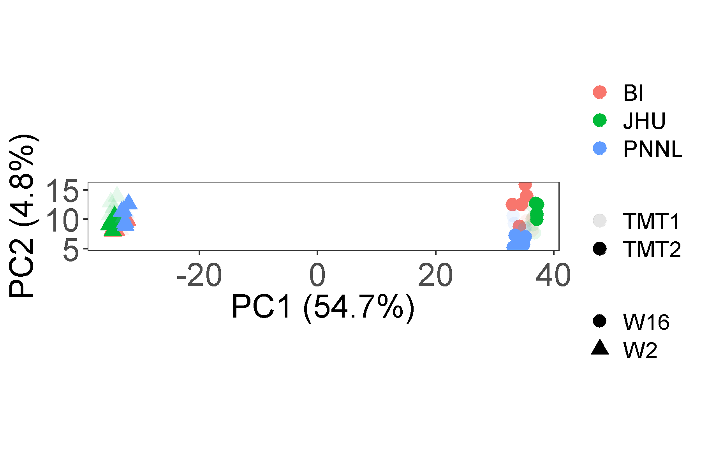

<p class="caption">

**Figure 4E.** Custom plot.

</p>

</div>

#### 2.2.5 Beyond the first two dimensions

The PCA findings at higher dimensions may be visualized via pairwise
plots between principal components.

``` r
prnPCA(
  show_ids = FALSE,
  rank. = 4, 
  dimension = 3,
  filename = d3.png,
)
```

<div class="figure" style="text-align: center">

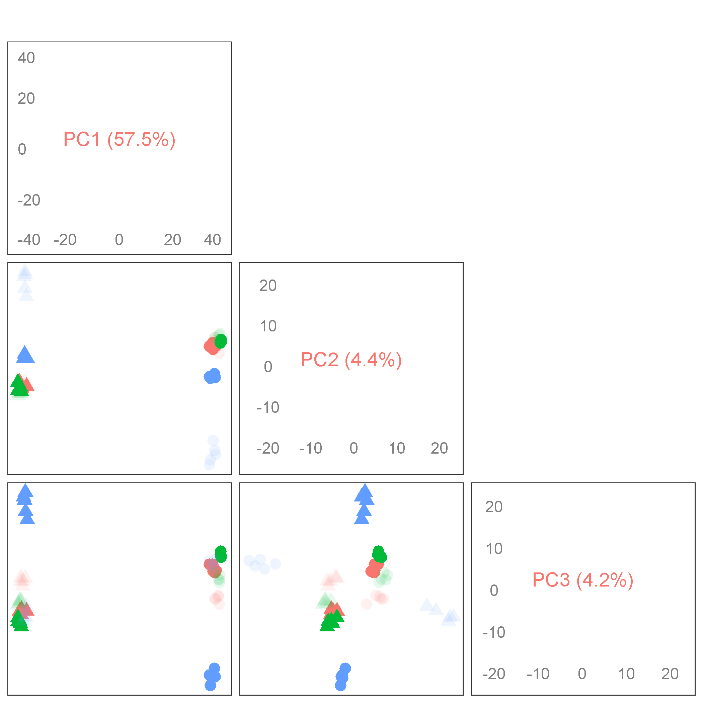

<p class="caption">

**Figure 4F.** Higher dimensions.

</p>

</div>

Additional examples and analogous high-dimension MDS can be found from
the help documents via `?prnPCA` and `?prnMDS`, respectively.

### 2.3 LDA

See notes
<strong>[here](https://proteoq.netlify.app/post/lda-in-proteoq/)</strong>.

### 2.4 Correlation plots

In this section, we visualize the batch effects and biological
differences through correlation plots. The `proteoQ` tool currently
limits itself to a maximum of 44 samples for a correlation plot. In the
document, we will perform correlation analysis against the `PNNL` data
subset. By default, samples will be arranged by the alphabetical order
for entries under the column `expt_smry.xlsx::Select`. We have learned
from the earlier `MDS` analysis that the batch effects are smaller than
the differences between `W2` and `W16`. We may wish to put the `TMT1`
and `TMT2` groups adjacent to each other for visualization of more
nuance batch effects, followed by the comparison of WHIM subtypes. We
can achieve this by supervising sample IDs at a customized order. In the
`expt_smry.xlsx`, We have prepared an `Order` column where samples
within the `JHU` subset were arranged in the descending order of
`W2.TMT1`, `W2.TMT2`, `W16.TMT1` and `W16.TMT2`. Now we tell the program
to look for the `Order` column for sample arrangement:

``` r
# peptide logFC
pepCorr_logFC(
  col_select = PNNL,
  col_order = Order, 
  filename = pep_pnnl.png,
)

# protein logFC
prnCorr_logFC(
  col_select = PNNL,
  col_order = Group,
  filename = prn_pnnl.png,
)
```

<div class="figure" style="text-align: center">


<p class="caption">

**Figure 5A-5B.** Correlation of log2FC for the `PNNL` subset. Left:
peptide; right, protein

</p>

</div>

To visualize the correlation of intensity data, we can use
`pepCorr_logInt` and `prnCorr_logInt` for peptide and protein data,
respectively. More details can be assessed via `?pepCorr_logFC`.

### 2.5 Heat maps

Heat map visualization is commonly applied in data sciences. The
corresponding facilities in `proteoQ` are `pepHM` and `prnHM` for
peptide and protein data, respectively. They are wrappers of
[`pheatmap`](https://cran.r-project.org/web/packages/pheatmap/pheatmap.pdf)
with modifications and exception handlings. More details can be found by
accessing the help document via `?prnHM`.

The following shows an example of protein heat map:

``` r
prnHM(
  xmin = -1, 
  xmax = 1, 
  xmargin = 0.1, 
  annot_cols = c("Group", "Color", "Alpha", "Shape"), 
  annot_colnames = c("Group", "Lab", "Batch", "WHIM"), 
  cluster_rows = TRUE, 
  cutree_rows = 10, 
  show_rownames = FALSE, 
  show_colnames = TRUE, 
  fontsize_row = 3, 
  cellwidth = 14, 
  filter_sp = exprs(species == "human"),
)
```

we chose to top annotate the heat map with the metadata that can be
found under the columns of `Group`, `Color`, `Alpha` and `Shape` in
`expt_smary.xlsx`. For better convention, we rename them to `Group`,
`Lab`, `Batch` and `WHIM` to reflect their sample characteristics. We
further supplied a vararg of `filter_sp` where we assume exclusive
interests in human proteins.

<div class="figure" style="text-align: center">

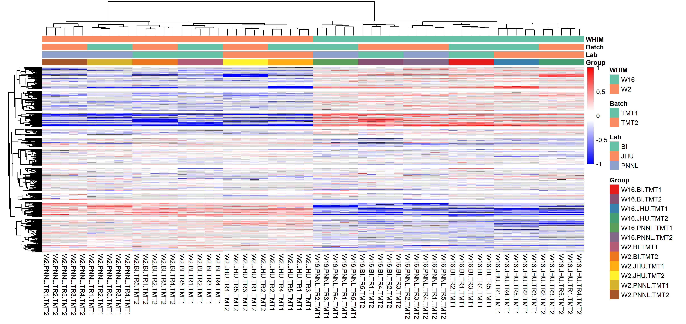

<p class="caption">

**Figure 6A.** Heat map visualization of protein log2FC

</p>

</div>

Row ordering of data is also implemented in the heat map utility.

``` r
prnHM(
  xmin = -1, 
  xmax = 1, 
  xmargin = 0.1, 
  annot_cols = c("Group", "Color", "Alpha", "Shape"), 
  annot_colnames = c("Group", "Lab", "Batch", "WHIM"), 
  cluster_rows = FALSE, 
  annot_rows = c("kin_class"), 
  show_rownames = TRUE, 
  show_colnames = TRUE, 
  fontsize_row = 2, 
  cellheight = 2, 
  cellwidth = 14, 
  filter_kin = exprs(kin_attr == TRUE, species == "human"),
  arrange_kin = exprs(kin_order, gene),
  filename = "hukin_by_class.png", 
)
```

In the above example, we applied vararg `filter_kin` to subset human
kinases from the protein data set by values under its `kin_attr` and the
`species` columns. We further row annotate the heat map with argument
`annot_rows`, which will look for values under the `kin_class` column.
With the vararg, `arrange_kin`, we supervise the row ordering of kinases
by values under the `kin_order` column and then those under the `gene`
column. Analogous to the user-supplied `filter_` arguments, the row
ordering varargs need to start with `arrange_` to indicate the task of
row ordering.

<div class="figure" style="text-align: center">

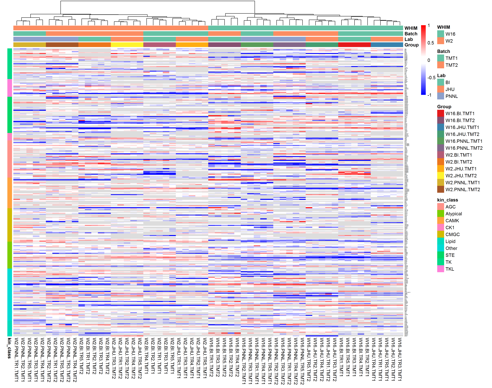

<p class="caption">

**Figure 6B.** Heat map visualization of kinase log2FC

</p>

</div>

See `?standPep` for peptide examples.

### 2.6 Significance tests

In this section, we perform the significance analysis of peptide and
protein data. The approach of contrast fit (Chambers, J. M. Linear
models, 1992; Gordon Smyth et al., `limma`) is taken in `proteoQ`. We
will first define the contrast groups for significance tests. For this
purpose, I have devided the samples by their WHIM subtypes, laboratory
locations and batch numbers. This ends up with entries of `W2.BI.TMT1`,
`W2.BI.TMT2` etc. under the `expt_smry.xlsx::Term` column. The
interactive environment between the Excel file and the `proteoQ` tool
allows us to enter more columns of contrasts when needed. For instance,
we might also be interested in a more course comparison of
inter-laboratory differences without batch effects. The corresponding
contrasts of `W2.BI`, `W16.BI` etc. can be found under a pre-made
column, `Term_2`. Having these columns in hand, we next perform
significance tests and data visualization for peptide and protein data:

``` r
# significance tests
pepSig(
  impute_na = FALSE, 
  W2_bat = ~ Term["W2.BI.TMT2-W2.BI.TMT1", 
                  "W2.JHU.TMT2-W2.JHU.TMT1", 
                  "W2.PNNL.TMT2-W2.PNNL.TMT1"], # batches
  W2_loc = ~ Term_2["W2.BI-W2.JHU", 
                    "W2.BI-W2.PNNL", 
                    "W2.JHU-W2.PNNL"], # locations
  W16_vs_W2 = ~ Term_3["W16-W2"], # types
)

# formulas matched to pepSig
prnSig(impute_na = FALSE)

# volcano plots
pepVol()
prnVol()
```

Note that we have informed the `pepSig` and `prnSig` utility to look for
contrasts under columns `Term`, `Term_2` etc., followed by the cotrast
pairs in square brackets. Pairs of contrasts are separated by commas.
The option of `impute_na` was set to FALSE as we might not known yet to
impute NA values or not. For more examples, such as at `impute_na =
TRUE`, try `?prnSig`.

The `pepVol` and `prnVol` utility will by default match the formulas of
contrasts with those in `pepSig`. The following plots show the batch
difference between two TMT experiments for each of the three
laboratories and the location difference between any two laboratories.

<div class="figure" style="text-align: left">

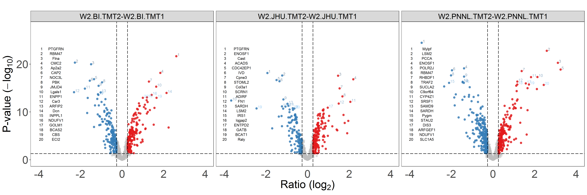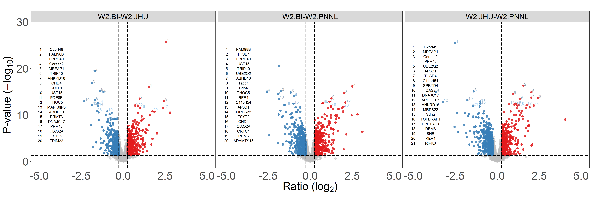

<p class="caption">

**Figure 7A-7B.** Volcano plots of protein log2FC. Left: between
batches; right: between locations.

</p>

</div>

In general, the special characters of `+` and `-` in contrast terms need
to be avoided in linear modeling. However, it may be sporadically
convenient to use `A+B` to denote a combined treatment of both `A` and
`B`. In the case, we will put the term(s) containing `+` or `-` into a
pair of pointy brackets. The syntax in the following hypothetical
example will compare the effects of `A`, `B`, `A+B` and the average of
`A` and `B` to control `C`.

``` r
# note that <A + B> is one condition whereas (A + B) contains two conditions
prnSig(
  fml = ~ Term["A - C", "B - C", "<A + B> - C", "(A + B)/2 - C"],
)
```

In addition to the fixed effects shown above, significance tests with
additive random effects are also supported. More examples can be found
via `?prnSig` and [Lab 3.3](###%203.3%20Random%20effects) in the
document.

### 2.7 Gene sets under volcano plots

There are a handful of `R` tools for gene set enrichement analysis, such
as GSEA, GSVA, gage, to name a few. It may be intuitive as well if we
can analyze and visualize the enrichment of gene sets under the context
of volcano plots at given contrasts. Provided the richness of `R`
utilities in linear modelings, the `preoteoQ` takes a naive approach
thereafter to assess the *asymmetricity* of protein probability \(p\)
values under volcano plots.

In the analysis of Gene Set Probability Asymmetricity (`GSPA`), protein
significance \(p\) values from linear modeling are first taken and
separated into the groups of up or down expressed proteins within a gene
set. The default is to calculate the geometric means, \(P\), for each of
the two groups with a penalty-like term:

\[-log10(P)=(\sum_{i=1}^{n}-log10(p_{i})+m)/(n+m)\]

where \(n\) and \(m\) are the numbers of entries with \(p\) values
\(\le\) or less than a significance cut-off, respectively, under a gene
set. The quotient of the two \(P\) values, one for up and one for down,
is then taken to represent the significance of enrichment for a given
gene set. Alternatively, the significance can be assessed via moderated
t-test between the two groups. With either method, the corresponding
mean `log2FC` are each calculated for the ups and the downs where the
difference is used as the fold change of enrichment.

At the input levels, the arguments `pval_cutoff` and `logFC_cutoff`
allow us to set aside low impact genes, for instance, (re)distributing
them between the \(n\)-entry significance group and the \(m\)-entry
insignificance group. On the output levels, argument `gspval_cutoff`
sets a threshold in gene set significance for reporting. More details
can be found from the help document via `?prnGSPA`. Note that currently
there is no peptide counterpart for the enrichment analysis.

We began with the analysis of `GSPA` against enrichment terms defined in
[`gene ontology
(GO)`](http://current.geneontology.org/products/pages/downloads.html)
and [`molecular signatures
(MSig)`](https://www.gsea-msigdb.org/gsea/index.jsp) data sets:

``` r
prnGSPA(
  impute_na = FALSE,
  pval_cutoff = 5E-2, # protein pVal threshold
  logFC_cutoff = log2(1.2), # protein log2FC threshold
  gspval_cutoff = 5E-2, # gene-set threshold
  gslogFC_cutoff = log2(1.2), # gene-set log2FC threshold
  gset_nms = c("go_sets", "c2_msig"), 
)
```

The formulas of contrasts will by default match to the those used in
`pepSig`. The species will be determined automatically from input data
and the corresponding databases will be loaded. In the above example of
pdx, databases of `GO` and `MSig` will be loaded for both human and
mouse. If we choose to focus on human proteins, we can add a vararg
statement such as `filter_sp = exprs(species == "human")`.

We next visualize the distribution of protein `log2FC` and `pVal` within
gene sets:

``` r
gspaMap(
  show_labels = TRUE,
  gspval_cutoff = 5E-3, 
  gslogFC_cutoff = log2(1.2), 
  # topn = 100, 
  gset_nms = c("go_sets"),
  show_sig = pVal,
  xco = 1.2, # position of two vertical lines for FC
  yco = 0.05, # position of a horizental line for pVal
)
```

This will produce the volcano plots of proteins under gene sets that
have passed our selection criteria. Here, we show one of the examples:

<div class="figure" style="text-align: center">

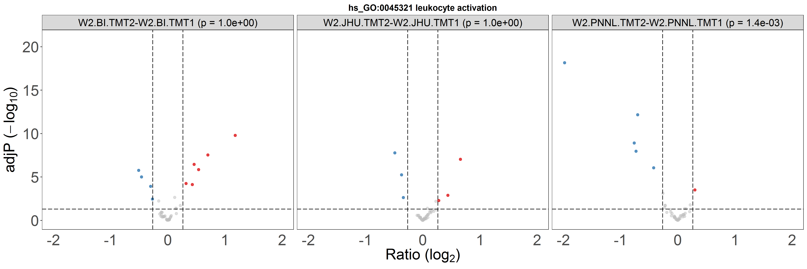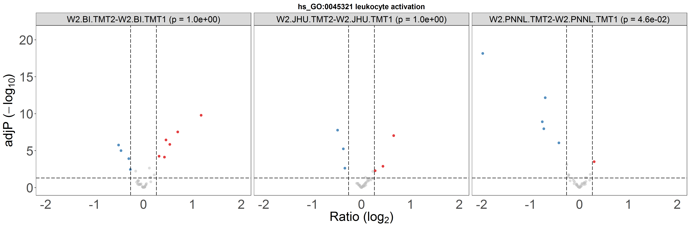

<p class="caption">

**Figure 8A.** An example of volcano plots of protein log2FC under a
gene set. Top, method = mean; bottom, method = limma.

</p>

</div>

The gene sets of `GO` and `MSig` are availble for species human, mouse
and rat in `proteoQ`. For custom gene sets and/or additional species,
the utility `prepGO` will download and prepare `GO` data according to
custom-supplied URLs. In the follow examples, we prepare the `GO` data
of `go_hs.rds` and `go_mm.rds` for `human` and `mouse`, respectively,
under the file folder `~\\proteoQ\\dbs\\go`:

``` r
prepGO(
  species = human,
  db_path = "~/proteoQ/dbs/go",
  gaf_url = "http://current.geneontology.org/annotations/goa_human.gaf.gz",
  obo_url = "http://purl.obolibrary.org/obo/go/go-basic.obo",
  filename = go_hs.rds,
)

prepGO(
  species = mouse,
  db_path = "~/proteoQ/dbs/go",
  gaf_url = "http://current.geneontology.org/annotations/mgi.gaf.gz",
  obo_url = "http://purl.obolibrary.org/obo/go/go-basic.obo",
  filename = go_mm.rds,
)

# head(readRDS(file.path("~/proteoQ/dbs/go", "go_hs.rds")))
# head(readRDS(file.path("~/proteoQ/dbs/go", "go_mm.rds")))
```

Similarly, we prepare custom `MSig` data bases for `human` and `mouse`:

``` r
prepMSig(
  # msig_url = "https://data.broadinstitute.org/gsea-msigdb/msigdb/release/7.0/c2.all.v7.0.entrez.gmt",
  # db_path = "~/proteoQ/dbs/msig",
  species = human,
  filename = msig_hs.rds,
)

prepMSig(
  # msig_url = "https://data.broadinstitute.org/gsea-msigdb/msigdb/release/7.0/c2.all.v7.0.entrez.gmt",
  # ortho_mart = mmusculus_gene_ensembl, 
  # db_path = "~/proteoQ/dbs/msig",  
  species = mouse,
  filename = msig_mm.rds,
)

# head(readRDS(file.path("~/proteoQ/dbs/msig", "msig_hs.rds")))
# head(readRDS(file.path("~/proteoQ/dbs/msig", "msig_mm.rds")))
```

We need to provide the list name of `ortho_mart` for species other than
human, mouse and rat. The value will be used for ortholog lookups via
[`biomaRt`](https://bioconductor.org/packages/release/bioc/html/biomaRt.html).
More details are available in the help document via `?prepMSig`. Note
that the data bases will be stored as `.rds` files, which can be used
with `prnGSPA` and `gspaMap` for analysis and visualization:

``` r
# start over
unlink(file.path(dat_dir, "Protein/GSPA"), recursive = TRUE, force = TRUE)

prnGSPA(
  impute_na = FALSE,
  pval_cutoff = 5E-2,
  logFC_cutoff = log2(1.2),
  gspval_cutoff = 5E-2,
  gslogFC_cutoff = log2(1.2), 
  gset_nms = c("~/proteoQ/dbs/go/go_hs.rds",
               "~/proteoQ/dbs/go/go_mm.rds", 
               "~/proteoQ/dbs/msig/msig_hs.rds", 
               "~/proteoQ/dbs/msig/msig_mm.rds"),
)

gspaMap(
  gset_nms = c("~/proteoQ/dbs/go/go_hs.rds",
               "~/proteoQ/dbs/go/go_mm.rds", 
               "~/proteoQ/dbs/msig/msig_hs.rds", 
               "~/proteoQ/dbs/msig/msig_mm.rds"),
  impute_na = FALSE,
  show_labels = FALSE, 
  gspval_cutoff = 5E-2, 
  gslogFC_cutoff = log2(1.2), 
  show_sig = pVal, 
  xco = 1.2, 
  yco = 0.05, 
)
```

As expected, in the examples of `MSig`, some breast cancer signatures in
basal and luminal subtypes were captured.

<div class="figure" style="text-align: center">

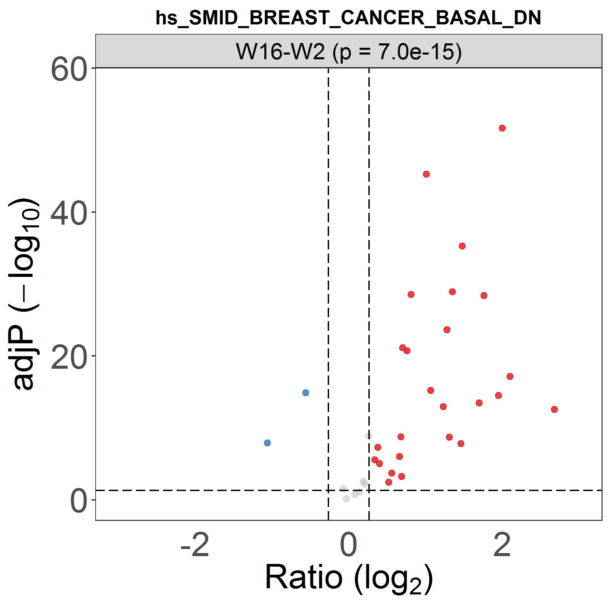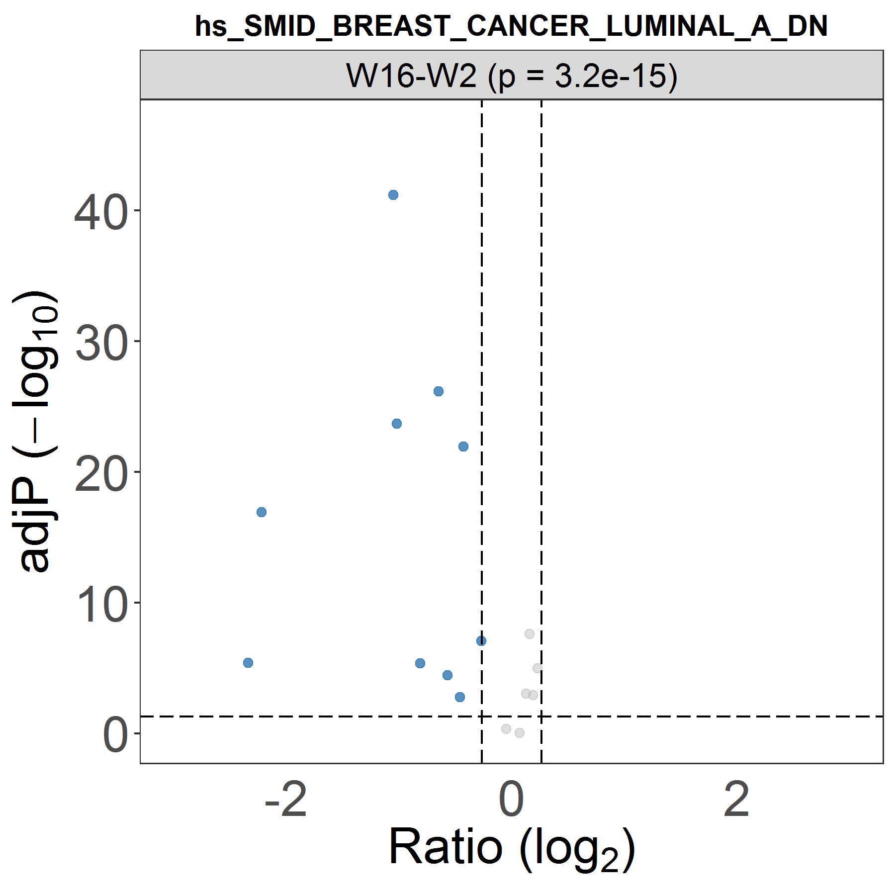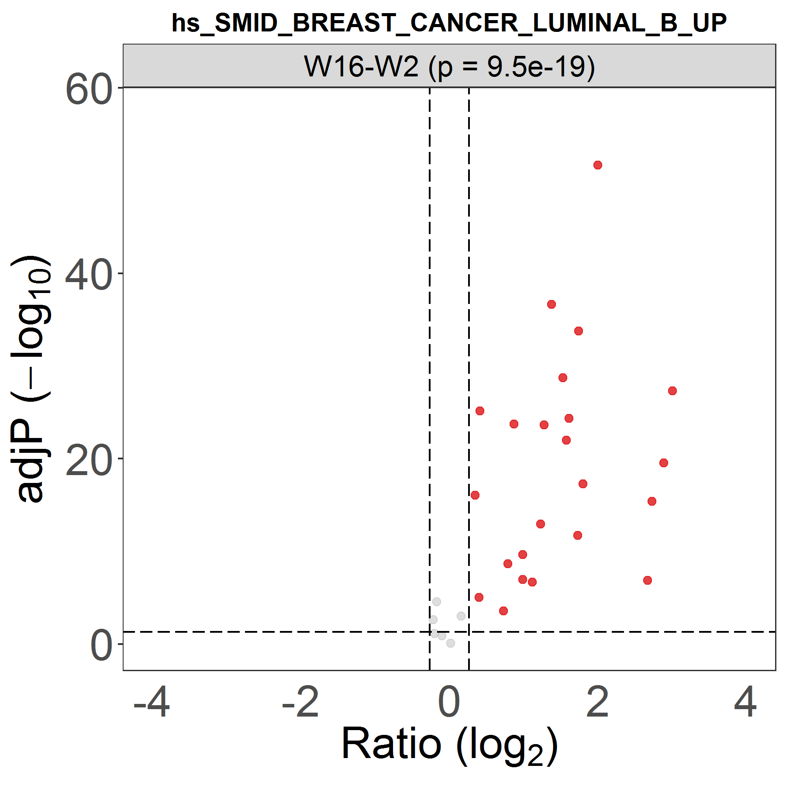

<p class="caption">

**Figure 8B.** Examples of volcano plots of protein log2FC under
molecular signatures.

</p>

</div>

Currently, proteoQ does not keep track of the values of `gset_nms` in
the various calls to `prnGSPA`. When mapping the findings from `prnGSPA`
to `gspaMap`, we need to be responsible for the completeness of the
gene-set *space*. If we were to leave out the setting of `gset_nms`, the
default of `gset_nms = c("go_sets", "c2_msig")` will be applied when
executing `gspaMap`. We might thus encounter some discrepancies in the
volcano plots of GO terms due to probable differences between the
default and the custom data bases.

For simplicity, it is generally applicable to include all the data bases
that have been applied to `prnGSPA` in a custom workflow and, in that
way, no terms will be missed out for visualization. This is also
suitable in that `gspaMap` merely perform volcano plot visualization by
gene sets and no multiple-test correlations are involved.

In addition to finding gene sets with significance, `prnGSPA` reports
the essential gene sets using a greedy set cover algorithm by
[`RcppGreedySetCover`](cran.r-project.org/web/packages/RcppGreedySetCover/RcppGreedySetCover.pdf).
The correspondance between essential and all of the gene sets are stored
in `_essmap.txt` files under the `Protein\GSPA` folder.

The utility in `proteoQ` for conventional GSEA analysis is `prnGSEA()`.
Gene set variance analysis (GSVA) is available through `prnGSVA`.
Details can be found via `?prnGSEA` and `?prnGSVA`, respectively, from
an `R` console.

### 2.8 Gene set networks

In the above section, we have plotted the enrichment of gene sets by
individual GO or KEGG terms. Depending on how much the sample groups
contrast to each other, we could have produced more plots where many of
them might never get viewed. Besides, gene sets can be redundant with
overlaps to one another to varying degrees. A means to communicate the
gene set results at high levels is to present them as hierarchical trees
or grouped networks.

In this section, we will visualize the connectivity of significant gene
sets by both distance heat maps and networks. For simplicity, the heat
maps or networks will be constructed only between gene sets and
essential gene sets. As mentioned in section `Gene sets under volcano
plots`, the essential gene sets were approximated with greedy set cover.
This will reduce the dimensionality of data from \(n \times n\) to
\(n \times m\) (\(m \le n\)).

We next gauge the redundancy of a gene set in relative to an essential
set by counting the numbers of intersecting gene IDs. This is documented
as the `fraction` of overlap between gene sets when calling `prnGSPA`.
The values are available in output files such as
`Protein\GSPA\essmap_.*.csv`. For network visualization, the gene sets
are further classified by their distance using hierarchical clustering.

In this following, we first perform simple heat map visualization
between all significant gene sets in columns and essential groups in
rows.

``` r
prnGSPAHM(
  annot_cols = "ess_idx",
  annot_colnames = "Eset index",
  filename = "all_sets.png", 
)
```

The distance in heat is \(D = 1-f\) where \(f\) is the fraction of
overlap in IDs between two gene sets. The smaller the distance, the
greater the overlap is between two gene sets. For convenience, a
`distance` column is also made available in the `_essmap.txt` file.

<div class="figure" style="text-align: center">


<p class="caption">

**Figure 8C.** Heat map visualization of the distance between all and
essential gene sets. The contrasts are defined in ‘prnSig(W2\_loc = )’
in section 2.4 Significance tests and volcano plot visualization

</p>

</div>

As expected, we saw zero overlap between human and mouse gene sets.
Within each organism, low-redundancy `red` cells overwhelm the heat map
and might have impeded us from capturing high-redundancy terms in
`blue`. We can, however, readily de-emphasize the `red` cells by data
filtration. In the example shown below, we chose to keep more redundant
terms at distances shorter than or equal to 0.33:

``` r
prnGSPAHM(
  filter2_by = exprs(distance <= .33),
  filter2_sp = exprs(start_with_str("hs", term)), 
  annot_cols = "ess_idx",
  annot_colnames = "Eset index",
  annot_rows = "ess_size", 
  filename = show_human_redundancy.png,
)
```

Note that there is a second `vararg` expression,
`exprs(start_with_str("hs", term))`. In this expression, we have used a
pseudonym approach to subset terms starting with character string `hs`
under the column `term` in `GSPA` result files, which corresponds to
human gene sets for both GO and KEGG.\[13\] More examples of the
pseudonym approach can be found from [Lab
3.2](###%203.2%20Data%20subsets) in this document. More examples of the
utility can be found via `?prnGSPAHM`.

<div class="figure" style="text-align: center">


<p class="caption">

**Figure 8D.** Heat map visualization of human gene sets at a distance
cut-off 0.2

</p>

</div>

Aside from heat maps, `prnGSPAHM` produces the networks of gene sets via
[`networkD3`](http://christophergandrud.github.io/networkD3/), for
interactive exploration of gene set redundancy.

<div class="figure" style="text-align: center">

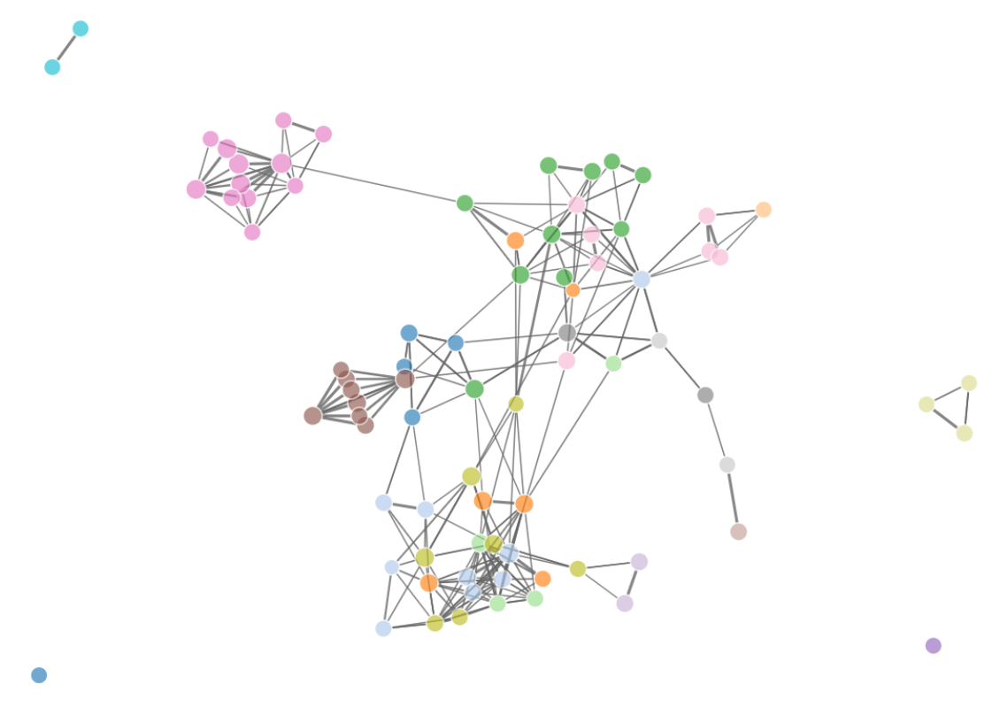

<p class="caption">

**Figure 8E.** Snapshots of the networks of biological terms. Left,
distance \<= 0.8; right, distance \<= 0.2.

</p>

</div>

### 2.9 Trend Analysis

In this section, we perform the trend analysis against protein
expressions. More information can be found from
[`cmeans`](https://www.rdocumentation.org/packages/e1071/versions/1.7-2/topics/cmeans).

#### 2.8.1 Clustering

The utility for the clustering of protein log2FC is `anal_prnTrend`.
Note that the number of clusters is provided by `n_clust`, which can be
a single value or a vector of integers.

``` r
anal_prnTrend(
  n_clust = c(5:6), 
  filter_by_npep = exprs(prot_n_pep >= 2),
)
```

The above codes will generate result files,
`Protein_Trend_Z_nclust5.txt` and `Protein_Trend_Z_nclust6.txt`, under
the `...\Protein\Trend` directory. The letter `Z` in the file names
remind us that the results were derived from normalized protein data
with the option of `scale_log2r = TRUE`. More details are available via
`?anal_prnTrend` from a R section.

#### 2.8.2 Visualization

We next visualize the results:

``` r
plot_prnTrend(
  col_order = Order,
)
```

The argument `col_order` provides a means to supervise the order of
samples during the trend visualization. In the above example, the
`plot_prnTrend` will look into the field under the
`expt_smry.xlsx::Order` column for sample arrangement (see also Section
2.3 Correlation plots).

<div class="figure" style="text-align: left">

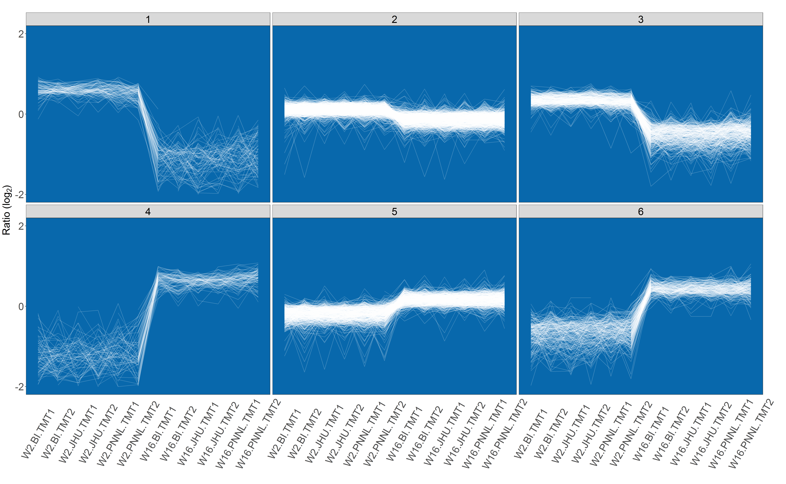

<p class="caption">

**Figure 9A.** Trends of protein log2FC (n\_clust = 6).

</p>

</div>

We can subset the secondary input data by `filter2_` varargs. In the
example shown below, we choose to visualize only the pattern of trends
in cluster 4. Note that `cluster` is a column key in
`Protein_Trend_[...].txt`:

``` r
plot_prnTrend(
  col_order = Order,
  filter2_by = exprs(cluster == 4),
  width = 12, 
  height = 12,
  filename = cl4.png,
)
```

<div class="figure" style="text-align: left">

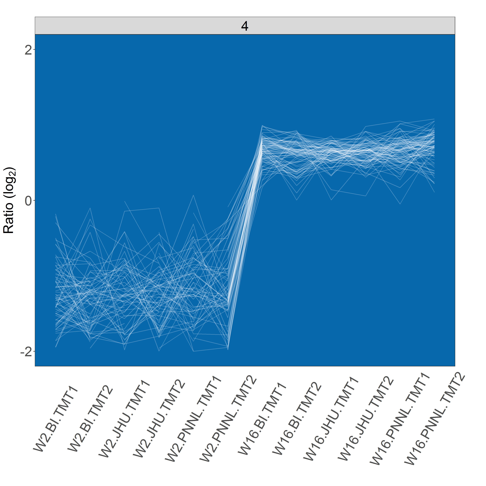

<p class="caption">

**Figure 9B.** Trends of protein log2FC at cluster 4 (n\_clust = 6).

</p>

</div>

We can also select certain sample groups for visualization, for
instance, the samples under the column of `expt_smry.xlsx::BI`:

``` r
plot_prnTrend(
  col_order = Order, 
  col_select = BI,
  filename = bi.png,
)
```

<div class="figure" style="text-align: left">

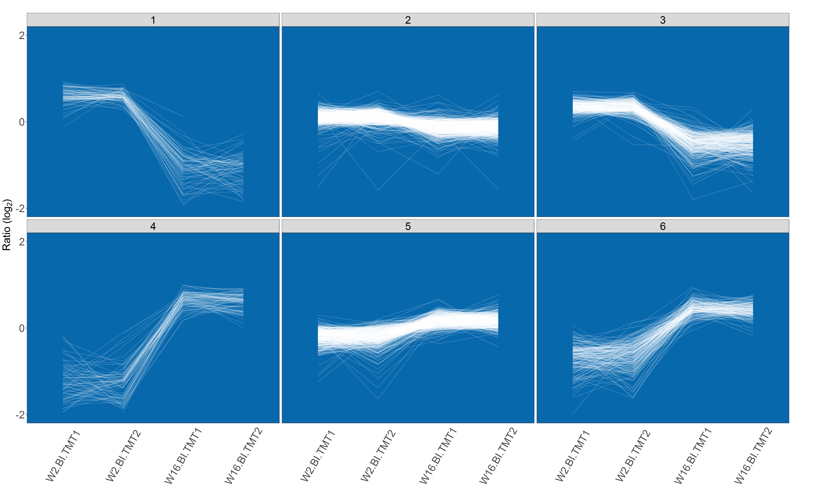

<p class="caption">

**Figure 9C.** Trends of protein log2FC for BI subset (n\_clust = 6).

</p>

</div>

Note the difference between

``` r
anal_prnTrend(col_select = BI, ...)
plot_prnTrend(col_select = NULL, ...)
```

and

``` r
anal_prnTrend(col_select = NULL, ...)
plot_prnTrend(col_select = BI, ...)
```

Apparently, they will both plot the trends of protein log2FC for the
`BI` subset. In spite, the former is based on the clustering results
from the `BI` subset whereas the later is based on the findings from all
samples. The same consideration will typically hold for various
informatic analysis in `proteoQ`, including the NMF analysis that we
will next discuss.

#### 2.8.3 API

The trend findings from `anal_prnTrend` can be loaded automatically to
the [`ClueGO`](http://apps.cytoscape.org/apps/cluego) utility in
[Cytoscape](https://cytoscape.org/). The installation of [yFiles Layout
Algorithms](http://apps.cytoscape.org/apps/with_tag/layout) is also
required.

``` r
# Make sure that Cytoscape is open
cluego(
  df2 = Protein_Trend_Z_nclust5.txt, 
  species = c(human = "Homo Sapiens"), 
  n_clust = c(3, 5)
)
```

Note that `human` is a value that can be found under the column
`species` in `Protein_Trend_Z_nclust5.txt` and `Homo Sapiens` is the
corresponding name used in ClueGO.

### 2.10 NMF Analysis

In this section, we will performs the analysis of non-negative matrix
factorization (NMF) against protein data. More details can be found from
[`NMF`](https://cran.r-project.org/web/packages/NMF/vignettes/NMF-vignette.pdf)
and the `?anal_prnNMF` wrapper. Since additional arguments can be passed
on to NMF, we will test below protein classifications with both the
default and the ‘lee’ method:

``` r
# load library
library(NMF)

# NMF analysis
anal_prnNMF(
  impute_na = FALSE,
  col_group = Group, # optional a priori knowledge of sample groups
  r = c(5:6),
  nrun = 20, 
  seed = 123,
  filter_by_npep = exprs(prot_n_pep >= 2),
)

anal_prnNMF(
  impute_na = FALSE,
  col_group = Group,
  method = "lee",
  r = c(5:6),
  nrun = 20, 
  seed = 123,
  filter_by_npep = exprs(prot_n_pep >= 2),
  filename = lee.txt,
)
```

Analogous analysis for peptide data are available via
`anal_pepNMF(...)`.

Following the primary NMF analysis, secondary utilities of
`plot_pepNMFCon` and `plot_prnNMFCon` prepare the consensus heat maps of
peptide and protein data, respectively. Similarly, `plot_pepNMFCoef` and
`plot_prnNMFCoef` prepare coefficient heat maps. Utility `plot_metaNMF`
makes the heat maps of protein `log2FC.` These utilities can pass
arguments to `pheatmap` as shown in **Section** 2.3. In the examples
shown below, we plot the heat maps for protein data against all
available ranks, which are 5 and 6, specified earlierly in the
`anal_prnNMF` step.

``` r
plot_prnNMFCon(
  impute_na = FALSE,
  annot_cols = c("Color", "Alpha", "Shape"),
  annot_colnames = c("Lab", "Batch", "WHIM"),
  width = 14,
  height = 14, 
)

plot_prnNMFCoef(
  impute_na = FALSE,
  annot_cols = c("Color", "Alpha", "Shape"), 
  annot_colnames = c("Lab", "Batch", "WHIM"), 
  width = 14, 
  height = 6, 
)

plot_metaNMF(
  impute_na = FALSE,
  annot_cols = c("Color", "Alpha", "Shape"), 
  annot_colnames = c("Lab", "Batch", "WHIM"), 
  cell_width = 6,
  fontsize = 6, 
  fontsize_col = 5,
)
```

Argument `impute_na` reminds us which piece(s) of NMF results from the
corresponding `anal_[...]NMF` will be used for plotting. The same is
true for `scale_log2r`, which defaults at TRUE. An error message will be
noted if no corresponding analysis results were found.

Visualization aganist data subset is also feasible. In the next example,
we will prepare heat maps for samples under column `BI` in
`expt_smry.xlsx`. We further limit ourselves to results from
`anal_prnNMF` at r = 5. In metagene plots, we choose additionally to row
order data by genes via the `arrange_` vararg:

``` r
plot_prnNMFCon(
  impute_na = FALSE,
  col_select = BI,
  r = 5, 
  annot_cols = c("Color", "Alpha", "Shape"),
  annot_colnames = c("Lab", "Batch", "WHIM"),
  fontsize = 8, 
  fontsize_col = 6,
  fontsize_row = 6, 
  width = 6.5,
  height = 6, 
  filename = bi_r5_con.png, 
)

plot_prnNMFCoef(
  impute_na = FALSE,
  col_select = BI,
  r = 5, 
  annot_cols = c("Color", "Alpha", "Shape"), 
  annot_colnames = c("Lab", "Batch", "WHIM"), 
  fontsize = 8, 
  fontsize_col = 6,
  fontsize_row = 6, 
  width = 12,
  height = 3, 
  filename = bi_r5_coef.png, 
)

plot_metaNMF(
  impute_na = FALSE,
  col_select = BI,
  r = 5, 
  annot_cols = c("Color", "Alpha", "Shape"), 
  annot_colnames = c("Lab", "Batch", "WHIM"), 
  # fontsize = 5, 
  # fontsize_col = 5,
  # cellwidth = 6,
  # cellheight = 6,
  cluster_rows = FALSE,
  arrange_by = exprs(gene),   
  filename = bi_r5_rowordered.png,
)
```

The silhouette information was obtained via the R package `cluster` and
shown as a track on the top of consensus and coefficient heat maps.

<div class="figure" style="text-align: left">

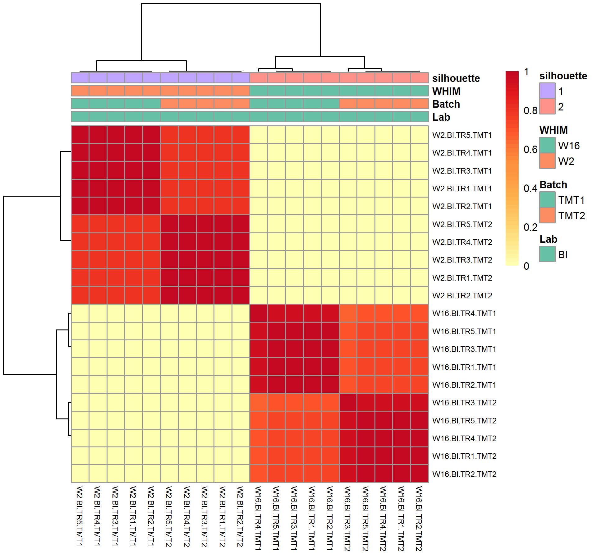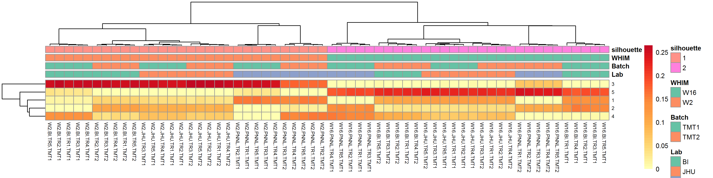

<p class="caption">

**Figure 10A-10B.** Heat map visualization of protein NMF results with
default method (results from method = “lee” not shown). Left: concensus;
right: coefficients; metagenes not shown.

</p>

</div>

While utility `plot_prnTrend` in trend visualization (**Section** 2.7)
can take a customized theme for uses in
[`ggplot2`](http://https://ggplot2.tidyverse.org/) therein, the `plot_`
functions in NMF are wrappers of
[`pheatmap`](https://cran.r-project.org/web/packages/pheatmap/pheatmap.pdf)
and thus can process a user-supplied color palette.

``` r
plot_prnNMFCon(
  color = colorRampPalette(rev(brewer.pal(n = 7, name = "RdYlBu")))(50), 
  ...
)

plot_prnNMFCoef(
  color = ..., 
)

plot_metaNMF(
  color = ...,
)
```

### 2.11 STRING Analysis

The following performs the [`STRING`](http://www.string-db.org) analysis
of protein-protein interactions. More details can be found from
`?anal_prnString`.

``` r
anal_prnString(
  db_path = "~/proteoQ/dbs/string",
  score_cutoff = .9,
  filter_by_sp = exprs(species %in% c("human", "mouse")), 
  filter_prots_by = exprs(prot_n_pep >= 2),
)
```

The results of protein-protein interaction is summarised in
`Protein_String_[...]_ppi.tsv` and the expression data in
`Protein_String_[...]_expr.tsv`. The files are formatted for direct
applications with [`Cytoscape`](https://cytoscape.org). When calling
`anal_prnString`, the corresponding databases will be downloaded
automatically if not yet present locally. One can also choose to
download separately the databases for a given `species`:

``` r
dl_stringdbs(
  species = rat,
  db_path = "~/proteoQ/dbs/string", 
)
```

### 2.12 Missing value imputation

Imputation of peptide and protein data are handle with `pepImp` and
`prnImp`. More information can be found from
[`mice`](https://cran.r-project.org/web/packages/mice/mice.pdf) and
`?prnImp`.

## 3 Labs

### 3.1 Reference choices

In this lab, we explore the effects of reference choices on data
normalization and cleanup.

#### 3.1.1 References on data scaling

We first copy data over to the file directory specified by `temp_dir`,
followed by PSM, peptide normalization and histogram visualization of
peptide `log2FC`.

``` r
# exemplary data
temp_dir <- "~/proteoQ/ref_w2"
dir.create(temp_dir, recursive = TRUE, showWarnings = FALSE)

library(proteoQDA)
copy_global_mascot(temp_dir)
copy_w2ref_exptsmry(temp_dir)
copy_global_fracsmry(temp_dir)

# analysis
library(proteoQ)
load_expts(temp_dir, expt_smry_ref_w2.xlsx)

normPSM(
  group_psm_by = pep_seq,
  group_pep_by = gene, 
  fasta = c("~/proteoQ/dbs/fasta/refseq/refseq_hs_2013_07.fasta", 
            "~/proteoQ/dbs/fasta/refseq/refseq_mm_2013_07.fasta"), 
  rptr_intco = 1000,
  rm_craps = TRUE,
  rm_krts = FALSE,
  rm_outliers = FALSE, 
  annot_kinases = TRUE, 
  plot_rptr_int = TRUE, 
  plot_log2FC_cv = TRUE, 
  filter_peps = exprs(pep_expect <= .1), 
)

PSM2Pep()
mergePep()
standPep()

pepHist(
  scale_log2r = FALSE, 
  ncol = 9,
)
```

Notice that in the histograms the `log2FC` profiles of `WHIM16` samples
are much narrower than those of `WHIM2` (**Figure S1A**). This will
occur when a reference is more similar to one group of sample(s) than
the other. In our case, the reference is one of `WHIM2`. The difference
in the breadth of `log2FC` profiles between the `WHIM16` and the `WHIM2`
groups is likely due to the genuine difference in their proteomes. If
the above argument is valid, a scaling normalize would moderate, and
thus bias, the quantitative difference in proteomes between `WHIM2` and
`WHIM16`.

<div class="figure" style="text-align: center">


<p class="caption">

**Figure S1A.** Histograms of peptide log2FC with a WHIM2 reference.

</p>

</div>

We alternatively seek a “center-of-mass” representation for uses as
references. We select one `WHIM2` and one `WHIM16` from each 10-plex
TMT. The `proteoQ` tool will average the signals from designated
references. Thefore, the derived reference can be viewed as a mid point
of the `WHIM2` and the `WHIM16` proteomes. We next perform analogously
the data summary and histogram visualization.

``` r
temp_dir_w2w16 <- "~/proteoQ/ref_w2w16"
dir.create(temp_dir_w2w16, recursive = TRUE, showWarnings = FALSE)

library(proteoQDA)
copy_global_mascot(temp_dir_w2w16)
copy_w2w16ref_exptsmry(temp_dir_w2w16)
copy_global_fracsmry(temp_dir_w2w16)

library(proteoQ)
load_expts(temp_dir_w2w16, expt_smry_ref_w2_w16.xlsx)

normPSM(
  group_psm_by = pep_seq,
  group_pep_by = gene, 
  fasta = c("~/proteoQ/dbs/fasta/refseq/refseq_hs_2013_07.fasta", 
            "~/proteoQ/dbs/fasta/refseq/refseq_mm_2013_07.fasta"), 
  rptr_intco = 1000,
  rm_craps = TRUE,
  rm_krts = FALSE,
  rm_outliers = FALSE, 
  annot_kinases = TRUE, 
  plot_rptr_int = TRUE, 
  plot_log2FC_cv = TRUE, 
  filter_peps = exprs(pep_expect <= .1), 
)

PSM2Pep()
mergePep()
standPep()

pepHist(
  scale_log2r = FALSE, 
  ncol = 8,
)
```

With the new reference, we have achieved `log2FC` profiles that are more
comparable in breadth between `WHIM2` and `WHIM16` samples and a
subsequent scaling normalization seems more suitable.

<div class="figure" style="text-align: center">


<p class="caption">

**Figure S1B.** Histograms of peptide log2FC with a combined WHIM2 and
WHIM16 reference.

</p>

</div>

#### 3.1.2 References on data CV

In this section, we explore the effects of reference choices on the CV
of `log2FC`. For simplicity, we will visualize the peptide data that
link to the `BI` subset at batch number one. We first add a new column,
let’s say `BI_1`, in `expt_smry_ref_w2.xlsx` with the corresponding
samples being indicated. We next display the distributions of proteins
CV measured from contributing peptides before data removals (**Figure
S1C**):

``` r
# continue on the `ref_w2` example in section 3.1.1
library(proteoQ)
load_expts("~/proteoQ/ref_w2", expt_smry_ref_w2.xlsx, frac_smry.xlsx)

# `BI_1` subset for visualization
purgePep(
  col_select = BI_1, 
  ymax = 1.2,
  ybreaks = .5,
  width = 8,
  height = 8,
  flip_coord = TRUE, 
  filename = bi1.png,
)
```

Notice that the CV distributions of `WHIM2` are much narrower than those
of `WHIM16`. This makes intuitive sense given that the `log2FC` profiles
of WHIM2 are much narrows as well (**Figure S1A**). To discount the
genuine difference in sample CV, we next trim relatively the data points
by percentiles:

``` r
purgePep(
  col_select = BI_1, 
  pt_cv = .95, 
  ymax = 1.2,
  ybreaks = .5,
  width = 8,
  height = 8,
  flip_coord = TRUE, 
  filename = bi1_ptcv.png,  
)
```

<div class="figure" style="text-align: left">

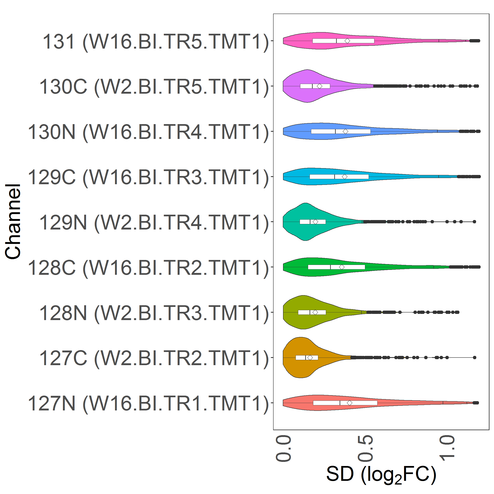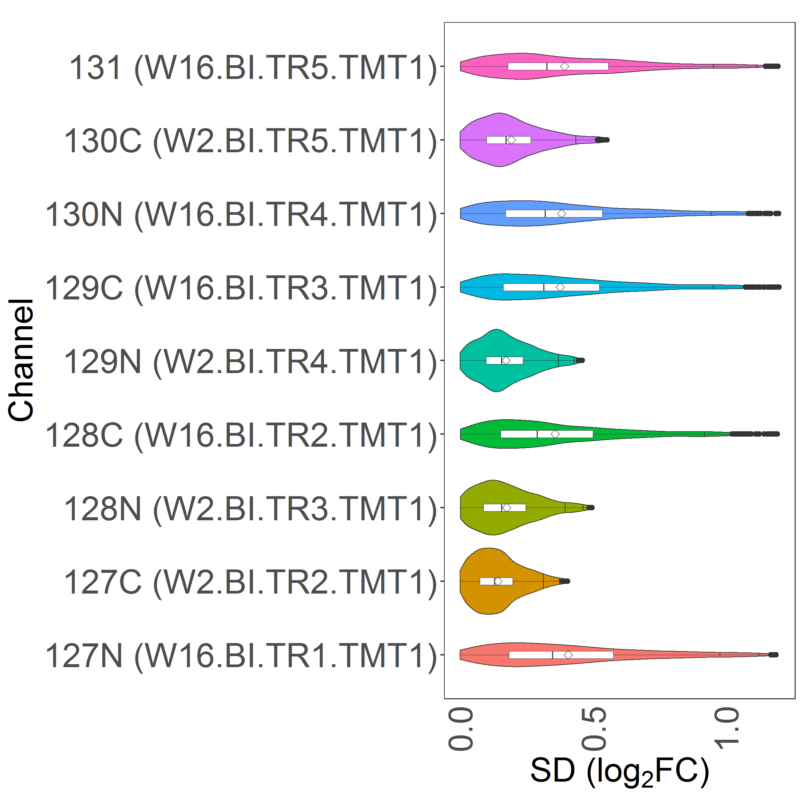

<p class="caption">

**Figure S1C-S1D.** Protein CV from peptide measures with WHIM2
reference. Left: before trimming; right: after trimming.

</p>

</div>

### 3.2 Data subsets and additions

The row filtrations and column additions of data are both available in
proteoQ.

#### 3.2.1 Subsets

In this lab, we will first apply pseudoname approaches to subset data.
The availble pesudonames include

  - `contain_str`: contain a literal string; “PEPTIDES” contain\_str
    “TIDE”.  
  - `contain_chars_in`: contain some of the characters in a literal
    string; “PEPTIDES” contain\_chars\_in “XP”.  
  - `not_contain_str`: not contain a literal string; “PEPTIDES”
    not\_contain\_str “TED”.
  - `not_contain_chars_in`: not contain any of the characters in a
    literal string; “PEPTIDES” not\_contain\_chars\_in “CAB”.  
  - `start_with_str`: start with a literal string. “PEPTIDES”
    start\_with\_str “PEP”.
  - `end_with_str`: end with a literal string. “PEPTIDES” end\_with\_str
    “TIDES”.  
  - `start_with_chars_in`: start with one of the characters in a literal
    string. “PEPTIDES” start\_with\_chars\_in “XP”.  
  - `ends_with_chars_in`: end with one of the characters in a literal
    string. “PEPTIDES” ends\_with\_chars\_in “XS”.

These functions are typically coupled to the varargs of `filter_` or
`slice_` for the subsetting of data rows based on their names. More
information can be found from the help document via `?contain_str`. In
the following example, we will apply `contain_chars_in` to subset
peptide data.

The CPTAC publication contains both global and phosphopeptide data from
the same samples. This allows us to explore the stoichiometry of
phosphopeptide subsets in relative to the combined data sets of `global
+ phospho` peptides. We first copy over both the global and the phospho
data sets to the file directory specified by `dat_dir`, followed by PSM,
peptide normalization and histogram visualization of peptide log2FC of
the `BI_1` subset.

``` r
# exemplary data
dat_dir <- "~/proteoQ/phospho_stoichiometry"
dir.create(dat_dir, recursive = TRUE, showWarnings = FALSE)

library(proteoQDA)
copy_global_mascot(dat_dir)
copy_phospho_mascot(dat_dir)
copy_global_exptsmry(dat_dir)
copy_cmbn_fracsmry(dat_dir)

# analysis
library(proteoQ)
load_expts()

# note that `group_psm_by = pep_seq_mod` 
normPSM(
  group_psm_by = pep_seq_mod,
  group_pep_by = gene, 
  fasta = c("~/proteoQ/dbs/fasta/refseq/refseq_hs_2013_07.fasta", 
            "~/proteoQ/dbs/fasta/refseq/refseq_mm_2013_07.fasta"), 
  filter_peps = exprs(pep_expect <= .1), 
)

PSM2Pep()
mergePep()

standPep(
    method_align = MGKernel, 
    range_log2r = c(10, 95), 
    range_int = c(5, 95), 
    n_comp = 3, 
    seed = 883, 
    maxit = 200, 
    epsilon = 1e-05, 
)

# (a) phospho subsets without y-scaling
pepHist(
  col_select = BI_1, 
  filter_peps = exprs(contain_chars_in("sty", pep_seq_mod)), 
  scale_y = FALSE, 
  ncol = 5, 
  filename = pSTY_bi1_scaley_no.png,
)

# (b) phospho subsets with y-scaling
pepHist(
  col_select = BI_1, 
  filter_peps = exprs(contain_chars_in("sty", pep_seq_mod)), 
  scale_y = TRUE, 
  ncol = 5, 
  filename = pSTY_bi1_scaley_yes.png,
)
```

Note that we have applied the new grammar of `contain_chars_in("sty",
pep_seq_mod)` to extract character strings containing lower-case letters
‘s’, ‘t’ or ‘y’ under the `pep_seq_mod` column in `Peptide.txt`. This
corresponds to the subsettting of peptides with phosphorylation(s) in
serine, thereonine or tyrosine.\[14\]

<div class="figure" style="text-align: left">

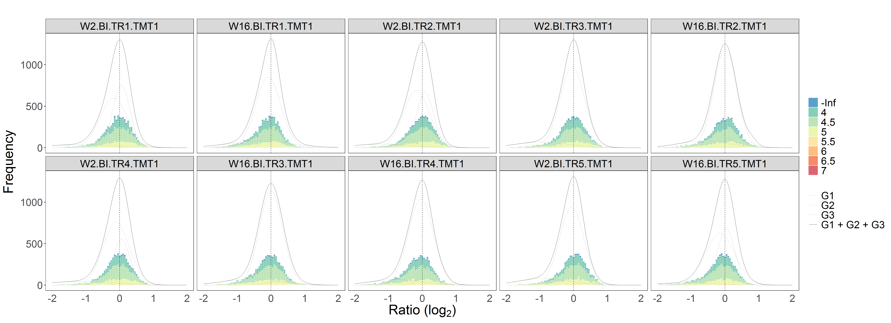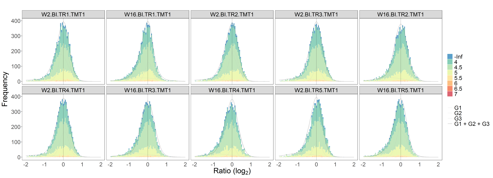

<p class="caption">

**Figure S2A-S2B.** Histograms of log2FC. Left: phosphopeptides without
y-axix scaling; right: phosphopeptides with y-axix scaling. The density
curves are from the combined data of global + phospho.

</p>

</div>

Ideally, the profiles of the `log2FC` between the `phospho` subsets and
the overall data would either align at the maximum density or perhaps
offset by similar distance among replicated samples. In this example,
the alignment at maximum density seems to be the case. The observation
raises the possibility of measuring the stoichiometry of
phosphoproteomes in relative to global data across sample types or
conditions.

In addition to pseudonyms, convenience columns such as
`pep_mod_protntac` and `pep_mod_sty` are made available in
`Peptide.txt`, to indicate the property of peptide modifications of
protein N-terminal acetylation and phosphorylation, respectively. We can
use alternatively the column keys to subset data, for example,
extracting peptides from N-terminal acetylated proteins:

``` r
# (c) N-term acetylation subsets without y-scaling
pepHist(
  col_select = BI_1, 
  scale_log2r = TRUE, 
  filter_peps = exprs(pep_mod_protntac == TRUE), 
  scale_y = FALSE, 
  ncol = 5, 
  filename = bi1_nac_scaley_no.png,
)

# (d) N-term acetylation subsets with y-scaling
pepHist(
  col_select = BI_1, 
  scale_log2r = TRUE, 
  filter_peps = exprs(pep_mod_protntac), 
  scale_y = TRUE, 
  ncol = 5, 
  filename = bi1_nac_scaley_yes.png,
)
```

<div class="figure" style="text-align: left">

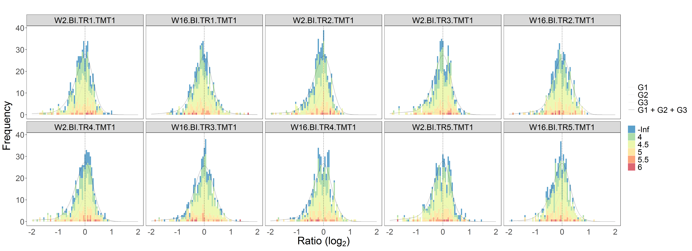

<p class="caption">

**Figure S2C-S2D.** Histograms of the log2FC of peptides from N-terminal
acetylated proteins. Left: without y-axix scaling; right: with y-axix
scaling.

</p>

</div>

Pseudonyms and convenience columns can be used interexchangeably for
simple conditions. In the following example, we assume that peptide
sequences are under the column `pep_seq_mod` in `Peptide.txt` with
variably modified residues in lower case. we can exclude oxidized
methione or deamidated asparagine from uses in data normalization:

``` r
Pep2Prn(
  filter_by_mn = exprs(not_contain_chars_in("mn", pep_seq_mod)),
)

standPrn(
  method_align = MGKernel, 
  range_log2r = c(5, 95), 
  range_int = c(5, 95), 
  n_comp = 2, 
  seed = 749662, 
  maxit = 200, 
  epsilon = 1e-05, 
)

prnHist(
  col_select = BI_1, 
  scale_log2r = TRUE, 
  scale_y = FALSE, 
  ncol = 5, 
  filter_prns_by = exprs(species == "mouse"),
  filename = "bi1_nac_scaley_no.png",
)

prnHist(
  col_select = BI_1, 
  scale_log2r = TRUE, 
  scale_y = TRUE, 
  ncol = 5, 
  filter_prns_by = exprs(species == "mouse"),
  filename = "bi1_nac_scaley_yes.png",
)
```

or use alternatively the convenience columns, `pep_mod_m` and
`pep_mod_n`, for the same purpose:

``` r
Pep2Prn(
  filter_by_mn = exprs(pep_mod_m == FALSE, pep_mod_n == FALSE),
)

standPrn(
  method_align = MGKernel, 
  range_log2r = c(5, 95), 
  range_int = c(5, 95), 
  n_comp = 2, 
  seed = 749662, 
  maxit = 200, 
  epsilon = 1e-05, 
)
```

#### 3.2.2 Column additions

Customer supplied columns can be further taken by proteoQ for various
data processing and informatic analyses. In this section, we will first
add a column, `n_not_na`, to protein table `Protein.txt`. The column
summarizes the number of `log2FC`s that are *NOT* missing for each
protein. The newly added column will then be applied to data-row
filtration during heat map visualization.

``` r
# add a column to "Protein.txt"
df <- readr::read_tsv(file.path(dat_dir, "Protein/Protein.txt")) 

library(magrittr)
n_not_na <- df %>% 
  dplyr::select(grep("Z_log2_R", names(.))) %>% 
  dplyr::select(-grep("\\(Ref|\\(Empty", names(.))) %>% 
  is.na() %>% 
  `!`() %>% 
  rowSums()

df %>% 
  dplyr::mutate(n_not_na = n_not_na) %>% 
  # proteoQ::reorderCols2() %>% 
  readr::write_tsv(file.path(dat_dir, "Protein/Protein.txt"))
```

Note that there is a restriction in column additions in that the custom
column(s) need to be anchored before the *intensity* and *ratio* fields
for uses in downstream analyses. This is achieved behind the scene when
the modified file is loaded, for example, in protein heat map
visualization:

``` r
prnHM(
  df = "Protein/Protein.txt", 
  xmin = -1,
  xmax = 1,
  xmargin = 0.1,
  annot_cols = c("Group", "Color", "Alpha", "Shape"),
  annot_colnames = c("Group", "Lab", "Batch", "WHIM"),
  cluster_rows = TRUE,
  cutree_rows = 10,
  show_rownames = FALSE,
  show_colnames = TRUE,
  fontsize_row = 3,
  cellwidth = 14,
  width = 18,
  height = 12,
  filter_prots_by_sp_npep = exprs(n_not_na <= 10),
  filename = "mostly_na_vals.png",
)
```

Importantly, we need to supply the file name to argument `df`. This is
because a higher precedence will be given to `Model/Protein_pVals.txt`
over `Protein.txt`. Without specifying the value of `df`, proteoQ will
look for the `n_not_na` column that are indeed absent from
`Protein_pVals.txt`.

<div class="figure" style="text-align: center">

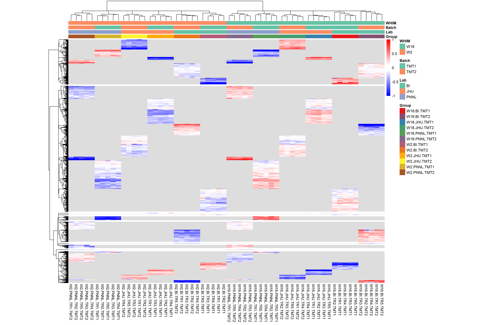

<p class="caption">

**Figure S2E.** Scarce heat map.

</p>

</div>

Alternatively, we may add the custom column to `Protein_pVals.txt`:

``` r
df <- readr::read_tsv(file.path(dat_dir, "Protein/Model/Protein_pVals.txt")) 

n_not_na <- df %>% 
  dplyr::select(grep("Z_log2_R", names(.))) %>% 
  dplyr::select(-grep("\\(Ref|\\(Empty", names(.))) %>% 
  is.na() %>% 
  `!`() %>% 
  rowSums()

df %>% 
  dplyr::mutate(na_counts = na_counts) %>% 
  readr::write_tsv(file.path(dat_dir, "Protein/Model/Protein_pVals.txt"))

prnHM(
  df = "Protein/Model/Protein_pVals.txt", 
  xmin = -1,
  xmax = 1,
  xmargin = 0.1,
  annot_cols = c("Group", "Color", "Alpha", "Shape"),
  annot_colnames = c("Group", "Lab", "Batch", "WHIM"),
  cluster_rows = TRUE,
  cutree_rows = 10,
  show_rownames = FALSE,
  show_colnames = TRUE,
  fontsize_row = 3,
  cellwidth = 14,
  width = 18,
  height = 12,
  filter_prots_by_sp_npep = exprs(n_not_na <= 10),
  filename = "na30.png",
)
```

### 3.3 Random effects

Models that incorporate both fixed- and random-effects terms in a linear
predictor expression are often termed mixed effects models.

#### 3.3.1 Single random effect

In proteomic studies involved multiple multiplex `TMT` experiments, the
limited multiplicity of isobaric tags requires sample parting into
subgroups. Measures in `log2FC` are then obtained within each subgroup
by comparing to common reference materials, followed by data bridging
across experiments. This setup violates the independence assumption in
statistical sampling as the measures of `log2FC` are batched by `TMT`
experiments. In this lab, we will use the CPTAC data to test the
statistical significance in protein abundance between the `WHIM2` and
the `WHIM16` subtypes, by first taking the batch effects into account.
We will use mixed-effects models to explore the random effects that were
introduced by the data stitching. In case that you would like to find
out more about mixed-effects models in R, I found the online
[tutorial](http://www.bodowinter.com/tutorial/bw_LME_tutorial2.pdf) a
helpful resource.

We start off by (re)executing the reduced example shown in
`?load_expts`:

``` r
dat_dir <- "~/proteoQ/randeffs/examples"
dir.create(dat_dir, recursive = TRUE, showWarnings = FALSE)

library(proteoQDA)
copy_global_exptsmry(dat_dir)
copy_global_fracsmry(dat_dir)
copy_global_mascot(dat_dir)

library(proteoQ)
load_expts()

normPSM(
  group_psm_by = pep_seq_mod, 
  group_pep_by = gene, 
  annot_kinases = TRUE, 
  fasta = c("~/proteoQ/dbs/fasta/refseq/refseq_hs_2013_07.fasta",
            "~/proteoQ/dbs/fasta/refseq/refseq_mm_2013_07.fasta"),
)

PSM2Pep()
mergePep()
standPep()
pepHist()

Pep2Prn(use_unique_pep = TRUE)
standPrn()
prnHist()
```

We next carry out the signficance tests with and without random effects:

``` r
pepSig(
  impute_na = FALSE, 
  W2_vs_W16_fix = ~ Term_3["W16-W2"], # fixed effect only
  W2_vs_W16_mix = ~ Term_3["W16-W2"] + (1|TMT_Set), # one fixed and one random effects
)

prnSig(impute_na = FALSE)

# volcano plots
prnVol(impute_na = FALSE)
```

In the formula linked to argument `W2_vs_W16_mix`, the random effect
`(1|TMT_Set)` is an addition to the fix effect `Term_3["W16-W2"]`. The
syntax `(1|TMT_Set)` indicates the `TMT_Set` term to be parsed as a
random effect. The name of the term is again a column key in
`expt_smry.xlsx`. In this example, the `TMT` batches are documented
under the column `TMT_Set` and can be applied directly to our formula.

Upon the completion of the protein significance tests, we can analyze
analogously the gene set enrichment against these new formulas by
calling functions `prnGSPA`, `gspaMAP` and `prnGSPAHM`. This results
will contain random effects in enrichment analysis aganist gene sets.

#### 3.3.2 Multiple random effects

In this section, we will test the statistical significance in protein
abundance changes between the `WHIM2` and the `WHIM16` subtypes, by
taking additively both the TMT batch effects and the laboratory effects
into account. At the time of writing the document, I don’t yet know how
to handle multiple random effects using `limma`. Alternatively, I use
`lmerTest` to do the work.

Missing values can frequently fail random-effects modeling with more
complex error structures and need additional cares. One workaround is to
simply restrict ourselves to entries that are complete in cases. This
would lead to a number of proteins not measurable in their statistical
significance. Alternatively, we may seek to fill in missing values using
techniques such as multivariate imputation.

We further note that the laboratory differences are coded under columns
`Color` in `expt_smry.xlsx`. We then test the statistical difference
between `WHIM2` and `WHIM16` against the following three models:

``` r
# impute NA
pepImp(m = 2, maxit = 2)
prnImp(m = 5, maxit = 5)

# significance tests
# really take a while; need to expedite `lm` as mentioned in "Advanced R" (Hadley Wichham, Ch. 24)
pepSig(
  impute_na = TRUE, # otherwise coerce to complete cases at multiple random effects
  method = lm,
  W2_vs_W16_fix = ~ Term_3["W16-W2"], # one fixed effect
  W2_vs_W16_mix = ~ Term_3["W16-W2"] + (1|TMT_Set), # one fixed and one random effect
  W2_vs_W16_mix_2 = ~ Term_3["W16-W2"] + (1|TMT_Set) + (1|Color), # one fixed and two random effects
)

prnSig(
  impute_na = TRUE, # otherwise coerce to complete cases at multiple random effects
  method = lm,
  W2_vs_W16_fix = ~ Term_3["W16-W2"], # one fixed effect
  W2_vs_W16_mix = ~ Term_3["W16-W2"] + (1|TMT_Set), # one fixed and one random effect
  W2_vs_W16_mix_2 = ~ Term_3["W16-W2"] + (1|TMT_Set) + (1|Color), # one fixed and two random effects
)

# correlation plots
read.csv(file.path(dat_dir, "Protein/Model/Protein_pVals.txt"), 
         check.names = FALSE, header = TRUE, sep = "\t") %>%
  dplyr::select(grep("pVal\\s+", names(.))) %>% 
  `colnames<-`(c("none", "one", "two")) %>% 
  dplyr::mutate_all(~ -log10(.x)) %>% 
  GGally::ggpairs(columnLabels = as.character(names(.)), labeller = label_wrap_gen(10), title = "", 
    xlab = expression("pVal ("*-log[10]*")"), ylab = expression("pVal ("*-log[10]*")")) 
```

The correlation plots indicate that the random effects of batches and
laboratory locations are much smaller than the fixed effect of the
biological differences of `WHIM2` and `WHIM16`.

<div class="figure" style="text-align: center">

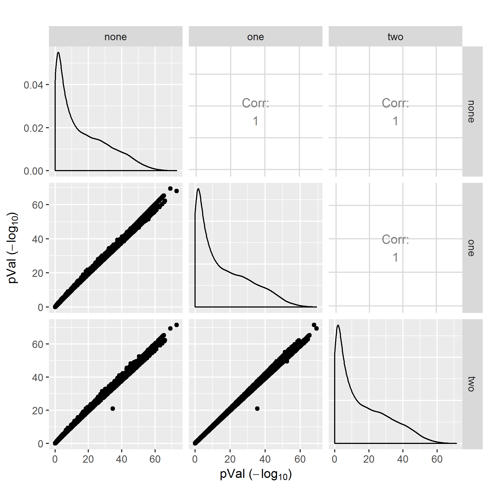

<p class="caption">

**Figure S3.** Pearson r of protein significance p-values.

</p>

</div>

## 4 Column keys

### 4.1 Mascot

The results are reported at the levels of PSMs, peptides and proteins.
The order of column keys can vary slightly provided different databases
or accession types.

#### 4.1.1 PSMs

PSMs are reported at the basis of per TMT experiment per series of LC/MS
data acquisition. The names of the result files are
`TMTset1_LCMSinj1_PSM_N.txt`, `TMTset2_LCMSinj1_PSM_N.txt` et al. with
the indexes of TMT experiment and LC/MS injection index being indicated
in the names. The column keys are described in [`Matrix
Science`](http://www.matrixscience.com/help/csv_headers.html) with the
following additions or modifications:

| Header                | Descrption                                                                                                                                                                         | Note                                                                                                                                                                                                                                                       |    |
| :-------------------- | :--------------------------------------------------------------------------------------------------------------------------------------------------------------------------------- | :--------------------------------------------------------------------------------------------------------------------------------------------------------------------------------------------------------------------------------------------------------- | :- |
| prot\_hit\_num        | Ordinal number of the protein hit (or protein family when grouping enabled)                                                                                                        | Mascot                                                                                                                                                                                                                                                     | NA |
| prot\_family\_member  | Ordinal number of the protein family member when grouping enabled                                                                                                                  | Mascot                                                                                                                                                                                                                                                     | NA |
| prot\_acc             | Protein accession string                                                                                                                                                           | Mascot                                                                                                                                                                                                                                                     | NA |
| prot\_desc            | Protein description taken from Fasta title line                                                                                                                                    | Mascot                                                                                                                                                                                                                                                     | NA |
| prot\_score           | Protein Mascot score                                                                                                                                                               | Mascot                                                                                                                                                                                                                                                     | NA |
| prot\_mass            | Protein mass                                                                                                                                                                       | Mascot                                                                                                                                                                                                                                                     | NA |
| prot\_matches         | Count of PSMs                                                                                                                                                                      | Mascot                                                                                                                                                                                                                                                     | NA |
| prot\_matches\_sig    | Count of PSMs that have significant scores under a proposed protein                                                                                                                | Joint Mascot `prot_matches_sig` from individual data sources; PSMs with void reporter-ion intensity (of shared peptides) are included.                                                                                                                     | NA |
| prot\_sequences       | Count of distinct sequences                                                                                                                                                        | Mascot                                                                                                                                                                                                                                                     | NA |
| prot\_sequences\_sig  | Count of distinct sequences that have significant scores under a proposed protein                                                                                                  | Joint Mascot `prot_sequences_sig` from individual data sources; the counts may be greater than `prot_sequences` when peptides with different variable modifications are treated as different identities                                                    | NA |
| prot\_len             | The number of amino acid residues under a proposed protein                                                                                                                         | Mascot; or proteoQ if absent from Mascot PSM exports                                                                                                                                                                                                       | NA |
| prot\_cover           | Protein sequence coverage                                                                                                                                                          | Calculated from the union of individual data sources                                                                                                                                                                                                       | NA |
| prot\_…               | Additional protein keys from Mascot PSM exports                                                                                                                                    | By users                                                                                                                                                                                                                                                   | NA |
| prot\_n\_psm          | Count of significant PSMs in quantitation under a proposed protein                                                                                                                 | By each TMT experiment and LC/MS series; the counts exclude entries that are void in reporter-ion intensity or filtered by users                                                                                                                           | NA |
| prot\_n\_pep          | Count of significant peptide sequences in quantitation under a proposed protein                                                                                                    | Cf. `prot_n_psm`                                                                                                                                                                                                                                           | NA |
| pep\_seq\_mod         | pep\_seq with variable modifications in the lower cases                                                                                                                            | See the help `?proteoQ::normPSM` from an R console for nomenclatures; for example, “-.\_mAsGVAVSDGVIK.V”, with a methionine oxidation and a serine phosphorylation                                                                                         | NA |
| pep\_query            | Ordinal number of query after sorting by Mr                                                                                                                                        | Mascot                                                                                                                                                                                                                                                     | NA |
| pep\_rank             | Peptide sequence match (PSM) rank. If two PSMs have same score they have the same rank.                                                                                            | Mascot                                                                                                                                                                                                                                                     | NA |
| pep\_isbold           | If grouping enabled, then a significant PSM. Otherwise, indicates this is the highest scoring protein that contains a match to this query.                                         | Mascot                                                                                                                                                                                                                                                     | NA |
| pep\_isunique         | Peptide sequence is unique to hit (grouping off) or family member (grouping on)                                                                                                    | Mascot                                                                                                                                                                                                                                                     | NA |
| pep\_exp\_mz          | Observed or experimental m/z value                                                                                                                                                 | Mascot                                                                                                                                                                                                                                                     | NA |
| pep\_exp\_mr          | Molecular mass calculated from experimental m/z value                                                                                                                              | Mascot                                                                                                                                                                                                                                                     | NA |
| pep\_exp\_z           | Observed or experimental charge                                                                                                                                                    | Mascot                                                                                                                                                                                                                                                     | NA |
| pep\_calc\_mr         | Molecular mass calculated from matched peptide sequence                                                                                                                            | Mascot                                                                                                                                                                                                                                                     | NA |
| pep\_delta            | pep\_exp\_mr – pep\_calc\_mr                                                                                                                                                       | Mascot                                                                                                                                                                                                                                                     | NA |
| pep\_start            | Ordinal position of first peptide residue in protein sequence                                                                                                                      | Cf. `prot_len`                                                                                                                                                                                                                                             | NA |
| pep\_end              | Ordinal position of last peptide residue in protein sequence                                                                                                                       | Cf. `prot_len`                                                                                                                                                                                                                                             | NA |
| pep\_miss             | Count of missed cleavage sites in peptide                                                                                                                                          | Mascot                                                                                                                                                                                                                                                     | NA |
| pep\_score            | Mascot score for PSM                                                                                                                                                               | Mascot                                                                                                                                                                                                                                                     | NA |
| pep\_expect           | Expectation value for PSM                                                                                                                                                          | Mascot                                                                                                                                                                                                                                                     | NA |
| pep\_res\_before      | Flanking residue on N-term side of peptide                                                                                                                                         | Mascot                                                                                                                                                                                                                                                     | NA |
| pep\_seq              | One-letter representation of peptide sequences                                                                                                                                     | See the help `?proteoQ::normPSM` from an R console for nomenclatures. For example, “-.\_MASGVAVSDGVIK.V”, the acetylations of protein N-terminals is indicated by ’\_’ and the flanking residues on the N- or C-terminal side of peptides separated by ‘.’ | NA |
| pep\_res\_after       | Flanking residue on C-term side of peptide                                                                                                                                         | Mascot                                                                                                                                                                                                                                                     | NA |
| pep\_var\_mod         | Variable modifications from all sources as list of names                                                                                                                           | Mascot                                                                                                                                                                                                                                                     | NA |
| pep\_var\_mod\_pos    | Variable modifications as a string of digits, e.g. ’0.0001000.0?. Non-zero digits identify mods according to key in export header. First and last positions are for terminus mods. | Mascot                                                                                                                                                                                                                                                     | NA |
| pep\_summed\_mod\_pos | When two variable modifications occur at the same site, a string of digits defining the second mod                                                                                 | Mascot                                                                                                                                                                                                                                                     | NA |
| pep\_local\_mod\_pos  | Query-level variable modifications as a string of digits. The names of the mods will be listed in pep\_var\_mod                                                                    | Mascot                                                                                                                                                                                                                                                     | NA |
| pep\_scan\_title      | Scan title taken from peak list                                                                                                                                                    | Mascot                                                                                                                                                                                                                                                     | NA |
| pep\_…                | Additional peptide keys from Mascot PSM exports                                                                                                                                    | By users                                                                                                                                                                                                                                                   | NA |
| pep\_len              | Number of amino acid residues in a peptide sequence                                                                                                                                |                                                                                                                                                                                                                                                            | NA |
| pep\_locprob          | The highest probablity from Mascot site analysis for the variable modification sites                                                                                               | The second highest probablity, `pep_locprob2`, not shown directly but summarized under `pep_locdiff`; Cf. `pep_var_mod_conf` from Mascot                                                                                                                   | NA |
| pep\_locdiff          | pep\_locprob – pep\_locprob2                                                                                                                                                       |                                                                                                                                                                                                                                                            | NA |
| pep\_n\_psm           | Counts of significant PSMs in quantitation under a proposed peptide                                                                                                                | Cf. `prot_n_psm`                                                                                                                                                                                                                                           | NA |
| raw\_file             | MS file name(s) where peptides or proteins are identified                                                                                                                          |                                                                                                                                                                                                                                                            | NA |
| gene                  | Protein gene name                                                                                                                                                                  |                                                                                                                                                                                                                                                            | NA |
| acc\_type             | The type of accession names                                                                                                                                                        | One of `refseq_acc`, `uniprot_acc` or `uniprot_id`                                                                                                                                                                                                         | NA |
| uniprot\_id           | Uniprot ID                                                                                                                                                                         | Optional for UniProt Fasta; the key will become `uniprot_acc` if the primary one is `uniprot_id`                                                                                                                                                           | NA |
| species               | The species of a protein entry                                                                                                                                                     |                                                                                                                                                                                                                                                            | NA |
| entrez                | Protein Entrez ID                                                                                                                                                                  |                                                                                                                                                                                                                                                            | NA |
| kin\_attr             | The attribute of proteins being kinases                                                                                                                                            | Optional at `normPSM(annot_kinases = TRUE, ...)`                                                                                                                                                                                                           | NA |
| kin\_class            | The classes of kinases, e.g., TK, TKL…                                                                                                                                             | Cf. `kin_attr`                                                                                                                                                                                                                                             | NA |
| kin\_order            | The order of “kin\_class” from the kinase tree diagram                                                                                                                             | Cf. `kin_attr`                                                                                                                                                                                                                                             | NA |
| is\_tryptic           | Logical indicating if a sequence belongs to a canonical tryptic peptide                                                                                                            | Optional when `pep_start` and `pep_end` are absent from Mascot PSMs                                                                                                                                                                                        | NA |
| I126 etc.             | Reporter-ion intensity from MS/MS ion search                                                                                                                                       | Mascot                                                                                                                                                                                                                                                     | NA |
| N\_I126 etc.          | Normalized reporter-ion intensity                                                                                                                                                  | The calibration factors for the alignment of `log2R...` are used to scale the reporter-ion intensity                                                                                                                                                       | NA |
| sd\_log2\_R126 etc.   | Standard deviation of peptide log2FC                                                                                                                                               | Calculated from contributing PSMs under each TMT channel                                                                                                                                                                                                   | NA |
| R126 etc.             | Linear FC relative to TMT-126                                                                                                                                                      |                                                                                                                                                                                                                                                            | NA |
| log2\_R126 etc.       | log2FC in relative to the average intensity of reference(s) under each multiplex TMT                                                                                               | Relative to the row-mean intensity within each multiplex TMT if no reference(s) are present                                                                                                                                                                | NA |
| N\_log2\_R126 etc.    | Median-centered `log2_R...`                                                                                                                                                        |                                                                                                                                                                                                                                                            | NA |

#### 4.1.2 Peptides

Prior to significance tests, the primary peptide outputs with and
without the imputation of NA values are summarized in `Peptide.txt` and
`Peptide_impNA.txt`, respectively. The column keys therein are described
in the following:

| Header               | Descrption                                                                                                                                 | Note                                                                                                                              |
| :------------------- | :----------------------------------------------------------------------------------------------------------------------------------------- | :-------------------------------------------------------------------------------------------------------------------------------- |
| prot\_acc            | Protein accession string                                                                                                                   | Mascot                                                                                                                            |
| prot\_desc           | Protein description taken from Fasta title line                                                                                            | Mascot                                                                                                                            |
| prot\_mass           | Protein mass                                                                                                                               | Mascot                                                                                                                            |
| prot\_matches\_sig   | Count of PSMs that have significant scores under a proposed protein                                                                        | Cf. PSM keys                                                                                                                      |
| prot\_sequences\_sig | Count of distinct sequences that have significant scores under a proposed protein                                                          | Cf. PSM keys                                                                                                                      |
| prot\_len            | The number of amino acid residues under a proposed protein                                                                                 | Cf. PSM keys                                                                                                                      |
| prot\_cover          | Protein sequence coverage                                                                                                                  | Cf. PSM keys                                                                                                                      |
| prot\_n\_psm         | Count of significant PSMs in quantitation under a proposed protein                                                                         | Joint results from individual PSM tables; the counts exclude entries that are void in reporter-ion intensity or filtered by users |
| prot\_n\_pep         | Count of significant peptide sequences in quantitation under a proposed protein                                                            | Cf. `prot_n_psm`                                                                                                                  |
| pep\_seq             | One-letter representation of peptide sequences                                                                                             | Cf. PSM keys; the key will become `pep_seq_mod` at `normPSM(group_psm_by = pep_seq_mod)`                                          |
| pep\_seq\_mod        | pep\_seq with variable modifications in the lower cases                                                                                    | Cf. PSM keys; the key will become `pep_seq` at `normPSM(group_psm_by = pep_seq)`                                                  |
| pep\_n\_psm          | Counts of significant PSMs in quantitation under a proposed peptide                                                                        | Cf. `prot_n_psm`                                                                                                                  |
| pep\_isunique        | Peptide sequence is unique to hit (grouping off) or family member (grouping on)                                                            | Mascot                                                                                                                            |
| pep\_calc\_mr        | Molecular mass calculated from matched peptide sequence                                                                                    | Mascot                                                                                                                            |
| pep\_start           | Ordinal position of first peptide residue in protein sequence                                                                              | Mascot; or proteoQ if absent from Mascot PSM exports                                                                              |
| pep\_end             | Mascot: ordinal position of last peptide residue in protein sequence                                                                       | Cf. `pep_start`                                                                                                                   |
| pep\_miss            | Count of missed cleavage sites in peptide                                                                                                  | Mascot                                                                                                                            |
| pep\_len             | Number of amino acid residues in a peptide sequence                                                                                        | Cf. PSM keys                                                                                                                      |
| pep\_rank            | Peptide sequence match (PSM) rank. If two PSMs have same score they have the same rank.                                                    | Median description from PSMs                                                                                                      |
| pep\_isbold          | If grouping enabled, then a significant PSM; otherwise, indicates this is the highest scoring protein that contains a match to this query. | Cf. `pep_rank`                                                                                                                    |
| pep\_exp\_mz         | Observed or experimental m/z value                                                                                                         | Cf. `pep_rank`                                                                                                                    |
| pep\_exp\_mr         | Molecular mass calculated from experimental m/z value                                                                                      | Cf. `pep_rank`                                                                                                                    |
| pep\_exp\_z          | Observed or experimental charge                                                                                                            | Cf. `pep_rank`                                                                                                                    |
| pep\_delta           | pep\_exp\_mr – pep\_calc\_mr                                                                                                               | Cf. `pep_rank`                                                                                                                    |
| pep\_score           | Mascot score for PSM                                                                                                                       | Cf. `pep_rank`                                                                                                                    |
| pep\_locprob         | The highest probablity from Mascot site analysis for the variable modification sites                                                       | Median description from PSMs                                                                                                      |
| pep\_locdiff         | pep\_locprob – pep\_locprob2                                                                                                               | Cf. PSM keys                                                                                                                      |
| pep\_expect          | Expectation value for PSM                                                                                                                  | Geometric-mean description from PSMs                                                                                              |
| pep\_mod\_protnt     | Logical indicating if a sequence Protein N-terminal modification                                                                           | Cf. `help(normPSM)` from an R console                                                                                             |
| pep\_mod\_protntac   | Logical indicating if a sequence contains Protein N-terminal acetylation                                                                   | v.s.                                                                                                                              |
| pep\_mod\_pepnt      | Logical indicating if a sequence contains N-terminal modification                                                                          | v.s.                                                                                                                              |
| pep\_mod\_m          | Logical indicating if a sequence contains methionine oxidation                                                                             | v.s.                                                                                                                              |
| pep\_mod\_n          | Logical indicating if a sequence contains asparagine deamidation                                                                           | v.s.                                                                                                                              |
| pep\_mod\_sty        | Logical indicating if a sequence contains the phospholyration of serine, threonine or tyrosine                                             | v.s.                                                                                                                              |
| pep\_mod\_pepct      | Logical indicating if a sequence contains C-terminal modification                                                                          | v.s.                                                                                                                              |
| pep\_mod\_protctam   | Logical indicating if a sequence contains Protein C-terminal amidation                                                                     | v.s.                                                                                                                              |
| pep\_mod\_protct     | Logical indicating if a sequence contains Protein C-terminal modification                                                                  | v.s.                                                                                                                              |
| pep\_mean\_raw       | Mean log2\_R (…) across samples                                                                                                            | Reference and `Empty` samples excluded.                                                                                           |
| pep\_mean\_n         | Mean N\_log2FC(…) across samples                                                                                                           | v.s.                                                                                                                              |
| pep\_mean\_z         | Mean Z\_log2FC(…) across samples                                                                                                           | v.s.                                                                                                                              |
| gene                 | Protein gene name                                                                                                                          |                                                                                                                                   |
| acc\_type            | The type of accession names                                                                                                                |                                                                                                                                   |
| uniprot\_id          | Uniprot ID                                                                                                                                 | Cf. PSM keys                                                                                                                      |
| entrez               | Protein Entrez ID                                                                                                                          |                                                                                                                                   |
| species              | The species of a protein entry                                                                                                             |                                                                                                                                   |
| kin\_attr            | The attribute of proteins being kinases                                                                                                    | Cf. PSM keys                                                                                                                      |
| kin\_class           | The classes of kinases, e.g., TK, TKL…                                                                                                     | Cf. PSM keys                                                                                                                      |
| kin\_order           | The order of “kin\_class” from the kinase tree diagram                                                                                     | Cf. PSM keys                                                                                                                      |
| is\_tryptic          | Logical indicating if a sequence belongs to a canonical tryptic peptide                                                                    | Cf. PSM keys                                                                                                                      |
| I… (…)               | Reporter-ion intensity                                                                                                                     | Calculated from the descriptive statistics by `method_psm_pep` in `PSM2Pep()` for indicated samples                               |
| N\_I… (…)            | Normalized I… (…)                                                                                                                          | The calibration factors for the alignment of log2FC are used to scale the reporter-ion intensity                                  |
| sd\_log2\_R (…)      | Standard deviation of protein log2FC                                                                                                       | Calculated from contributing peptides under each sample                                                                           |
| log2\_R (…)          | log2FC relative to reference materials for indicated samples                                                                               | Before normalization                                                                                                              |
| N\_log2\_R (…)       | Aligned log2\_R (…) according to method\_align in standPep() without scaling normalization                                                 |                                                                                                                                   |
| Z\_log2\_R (…)       | N\_log2\_R (…) with scaling normalization                                                                                                  |                                                                                                                                   |

#### 4.1.3 Proteins

Prior to significance tests, the primary protein outputs with and
without the imputation of NA values are summarized in `Protein.txt` and
`Protein_impNA.txt`, respectively. The corresponding column keys are
described in the following:

| Header               | Descrption                                                                                 | Note                                                                                                |
| :------------------- | :----------------------------------------------------------------------------------------- | :-------------------------------------------------------------------------------------------------- |
| gene                 | Protein gene name                                                                          |                                                                                                     |
| prot\_cover          | Protein sequence coverage                                                                  | Cf. PSM keys                                                                                        |
| prot\_acc            | Protein accession string                                                                   | Mascot                                                                                              |
| prot\_desc           | Protein description taken from Fasta title line                                            | Mascot                                                                                              |
| prot\_mass           | Protein mass                                                                               | Mascot                                                                                              |
| prot\_matches\_sig   | Count of PSMs that have significant scores under a proposed protein                        | Cf. PSM keys                                                                                        |
| prot\_sequences\_sig | Count of distinct sequences that have significant scores under a proposed protein          | Cf. PSM keys                                                                                        |
| prot\_len            | The number of amino acid residues under a proposed protein                                 | Cf. PSM keys                                                                                        |
| prot\_n\_psm         | Count of significant PSMs in quantitation under a proposed protein                         | Cf. Peptide keys                                                                                    |
| prot\_n\_uniqpsm     | Count of unique, significant PSMs in quantitation under a proposed protein                 |                                                                                                     |
| prot\_n\_pep         | Count of significant peptide sequences in quantitation under a proposed protein            | Cf. Peptide keys                                                                                    |
| prot\_n\_uniqpep     | Count of unique, significant peptide sequences in quantitation under a proposed protein    |                                                                                                     |
| prot\_mean\_raw      | Mean log2\_R (…) across samples                                                            | Reference and `Empty` samples excluded.                                                             |
| prot\_mean\_n        | Mean N\_log2FC(…) across samples                                                           | v.s.                                                                                                |
| prot\_mean\_z        | Mean Z\_log2FC(…) across samples                                                           | v.s.                                                                                                |
| acc\_type            | The type of accession names                                                                |                                                                                                     |
| uniprot\_id          | Uniprot ID                                                                                 | Cf. PSM keys                                                                                        |
| entrez               | Protein Entrez ID                                                                          |                                                                                                     |
| species              | The species of a protein entry                                                             |                                                                                                     |
| kin\_attr            | The attribute of proteins being kinases                                                    | Cf. PSM keys                                                                                        |
| kin\_class           | The classes of kinases, e.g., TK, TKL…                                                     | Cf. PSM keys                                                                                        |
| kin\_order           | The order of “kin\_class” from the kinase tree diagram                                     | Cf. PSM keys                                                                                        |
| I… (…)               | Reporter-ion intensity                                                                     | Calculated from the descriptive statistics by `method_pep_prn` in `Pep2Prn()` for indicated samples |
| N\_I… (…)            | Normalized I… (…)                                                                          | Cf. Peptide keys                                                                                    |
| log2\_R (…)          | log2FC relative to reference materials for indicated samples                               | Cf. Peptide keys                                                                                    |
| N\_log2\_R (…)       | Aligned log2\_R (…) according to method\_align in standPrn() without scaling normalization |                                                                                                     |
| Z\_log2\_R (…)       | N\_log2\_R (…) with scaling normalization                                                  |                                                                                                     |

### 4.2 MaxQuant

MaxQuant files shares the same folder structure as those of Mascot.

#### 4.2.1 PSMs

The column keys are defined in
[`MaxQuant`](http://www.coxdocs.org/doku.php?id=maxquant:table:msmstable)
with the following additions or modifications:

| Header              | Descrption                                                                           | Note                                                                                                                                                                         |
| :------------------ | :----------------------------------------------------------------------------------- | :--------------------------------------------------------------------------------------------------------------------------------------------------------------------------- |
| prot\_acc           | Protein accession string                                                             | `Proteins` in MaxQuant                                                                                                                                                       |
| prot\_desc          | Protein description taken from Fasta title line                                      |                                                                                                                                                                              |
| prot\_mass          | Protein mass                                                                         |                                                                                                                                                                              |
| prot\_len           | The number of amino acid residues under a proposed protein                           |                                                                                                                                                                              |
| prot\_cover         | Protein sequence coverage                                                            | Calculated from the union of individual data sources                                                                                                                         |
| prot\_n\_psm        | Count of significant PSMs in quantitation under a proposed protein                   | By each TMT experiment and LC/MS series; the counts exclude entries that are void in reporter-ion intensity or filtered by users                                             |
| prot\_n\_pep        | Count of significant peptide sequences in quantitation under a proposed protein      | Cf. `prot_n_psm`                                                                                                                                                             |
| pep\_seq            | One-letter representation of peptide sequences                                       | The acetylations of protein N-terminals is indicated by ’\_’ and the flanking residues on the N- or C-terminal side of peptides separated by ‘.’, e.g. “-.\_MASGVAVSDGVIK.V” |
| pep\_seq\_mod       | pep\_seq with variable modifications in the lower cases                              | E.g. “-.\_mAsGVAVSDGVIK.V” with a methionine oxidation and a serine phosphorylation                                                                                          |
| pep\_isunique       | Peptide sequence is unique at the levels of protein groups, protein IDs or none      | Cf. proteoQ help document via `?normPSM`                                                                                                                                     |
| pep\_res\_before    | Flanking residue on N-term side of peptide                                           |                                                                                                                                                                              |
| pep\_start          | Ordinal position of first peptide residue in protein sequence                        |                                                                                                                                                                              |
| pep\_end            | Ordinal position of last peptide residue in protein sequence                         |                                                                                                                                                                              |
| pep\_res\_after     | Flanking residue on C-term side of peptide                                           |                                                                                                                                                                              |
| pep\_n\_psm         | Counts of significant PSMs in quantitation under a proposed peptide                  | Cf. `prot_n_psm`                                                                                                                                                             |
| raw\_file           | MS file name(s) where peptides or proteins are identified                            |                                                                                                                                                                              |
| m/z                 | The mass-over-charge of the precursor ion.                                           | From MaxQuant                                                                                                                                                                |
| acc\_type           | The type of accession names                                                          | One of `refseq_acc`, `uniprot_acc` or `uniprot_id`                                                                                                                           |
| uniprot\_id         | Uniprot ID                                                                           | Optional for UniProt Fasta; the key will become `uniprot_acc` if the primary one is `uniprot_id`                                                                             |
| entrez              | Protein Entrez ID                                                                    |                                                                                                                                                                              |
| gene                | Protein gene name                                                                    |                                                                                                                                                                              |
| species             | The species of a protein entry                                                       |                                                                                                                                                                              |
| kin\_attr           | The attribute of proteins being kinases                                              | Optional at `normPSM(annot_kinases = TRUE, ...)`                                                                                                                             |
| kin\_class          | The classes of kinases, e.g., TK, TKL…                                               | Cf. `kin_attr`                                                                                                                                                               |
| kin\_order          | The order of “kin\_class” from the kinase tree diagram                               | Cf. `kin_attr`                                                                                                                                                               |
| is\_tryptic         | Logical indicating if a sequence belongs to a canonical tryptic peptide              |                                                                                                                                                                              |
| …                   | More column keys from MaxQuant                                                       | Cf. <http://www.coxdocs.org/doku.php?id=maxquant:table:msmstable>                                                                                                            |
| I126 etc.           | Reporter-ion intensity                                                               | Corrected or uncorrected from MaxQuant; c.f. `?normPSM`                                                                                                                      |
| N\_I126 etc.        | Normalized reporter-ion intensity                                                    | The calibration factors for the alignment of log2FC are used to scale the reporter-ion intensity                                                                             |
| sd\_log2\_R126 etc. | Standard deviation of peptide log2FC                                                 | Calculated from contributing PSMs under each TMT channel                                                                                                                     |
| R126 etc.           | Linear FC relative to TMT-126                                                        |                                                                                                                                                                              |
| log2\_R126 etc.     | log2FC in relative to the average intensity of reference(s) under each multiplex TMT | Relative to the row-mean intensity within each multiplex TMT if no reference(s) are present                                                                                  |
| N\_log2\_R126 etc.  | Median-centered log2\_R…                                                             |                                                                                                                                                                              |

#### 4.2.2 Peptides

The column keys in peptide tables are described below:

| Header             | Descrption                                                                                     | Note                                                                                                                                                                                                                                                                                |
| :----------------- | :--------------------------------------------------------------------------------------------- | :---------------------------------------------------------------------------------------------------------------------------------------------------------------------------------------------------------------------------------------------------------------------------------- |
| prot\_acc          | Protein accession string                                                                       | Cf. PSM keys                                                                                                                                                                                                                                                                        |
| prot\_desc         | Protein description taken from Fasta title line                                                |                                                                                                                                                                                                                                                                                     |
| prot\_mass         | Protein mass                                                                                   |                                                                                                                                                                                                                                                                                     |
| prot\_len          | The number of amino acid residues under a proposed protein                                     |                                                                                                                                                                                                                                                                                     |
| prot\_cover        | Protein sequence coverage                                                                      | Cf. PSM keys                                                                                                                                                                                                                                                                        |
| prot\_n\_psm       | Count of significant PSMs in quantitation under a proposed protein                             | Joint results from individual PSM tables; the counts exclude entries that are void in reporter-ion intensity or filtered by users                                                                                                                                                   |
| prot\_n\_pep       | Count of significant peptide sequences in quantitation under a proposed protein                | Cf. `prot_n_psm`                                                                                                                                                                                                                                                                    |
| pep\_seq           | One-letter representation of peptide sequences                                                 | Cf. PSM keys; the key will become `pep_seq_mod` at `normPSM(group_psm_by = pep_seq_mod)`                                                                                                                                                                                            |
| pep\_seq\_mod      | pep\_seq with variable modifications in the lower cases                                        | Cf. PSM keys; the key will become `pep_seq` at `normPSM(group_psm_by = pep_seq)`                                                                                                                                                                                                    |
| pep\_n\_psm        | Counts of significant PSMs in quantitation under a proposed peptide                            | Cf. `prot_n_psm`                                                                                                                                                                                                                                                                    |
| pep\_isunique      | Peptide sequence is unique at the levels of protein groups, protein IDs or none                | Cf. PSM keys                                                                                                                                                                                                                                                                        |
| pep\_start         | Ordinal position of first peptide residue in protein sequence                                  |                                                                                                                                                                                                                                                                                     |
| pep\_end           | Mascot: ordinal position of last peptide residue in protein sequence                           |                                                                                                                                                                                                                                                                                     |
| pep\_mod\_protnt   | Logical indicating if a sequence contains Protein N-terminal modification                      | Cf. `?normPSM` from an R console                                                                                                                                                                                                                                                    |
| pep\_mod\_protntac | Logical indicating if a sequence contains Protein N-terminal acetylation                       | v.s.                                                                                                                                                                                                                                                                                |
| pep\_mod\_pepnt    | Logical indicating if a sequence contains N-terminal modification                              | v.s.                                                                                                                                                                                                                                                                                |
| pep\_mod\_m        | Logical indicating if a sequence contains methionine oxidation                                 | v.s.                                                                                                                                                                                                                                                                                |
| pep\_mod\_n        | Logical indicating if a sequence contains asparagine deamidation                               | v.s.                                                                                                                                                                                                                                                                                |
| pep\_mod\_sty      | Logical indicating if a sequence contains the phospholyration of serine, threonine or tyrosine | v.s.                                                                                                                                                                                                                                                                                |
| pep\_mod\_pepct    | Logical indicating if a sequence contains C-terminal modification                              | v.s.                                                                                                                                                                                                                                                                                |
| pep\_mod\_protctam | Logical indicating if a sequence contains Protein C-terminal amidation                         | v.s.                                                                                                                                                                                                                                                                                |
| pep\_mod\_protct   | Logical indicating if a sequence contains Protein C-terminal modification                      | v.s.                                                                                                                                                                                                                                                                                |
| pep\_mean\_raw     | Mean log2\_R (…) across selected samples                                                       | Sample selection vai `standPep(col_select = ...)`                                                                                                                                                                                                                                   |
| pep\_mean\_n       | Mean N\_log2FC(…) across selected samples                                                      | v.s.                                                                                                                                                                                                                                                                                |
| pep\_mean\_z       | Mean Z\_log2FC(…) across selected samples                                                      | v.s.                                                                                                                                                                                                                                                                                |
| gene               | Protein gene name                                                                              |                                                                                                                                                                                                                                                                                     |
| m/z                | The mass-over-charge of the precursor ion.                                                     | Cf. PSM keys                                                                                                                                                                                                                                                                        |
| acc\_type          | The type of accession names                                                                    | Cf. PSM keys                                                                                                                                                                                                                                                                        |
| entrez             | Protein Entrez ID                                                                              |                                                                                                                                                                                                                                                                                     |
| uniprot\_id        | Uniprot ID                                                                                     | Cf. PSM keys                                                                                                                                                                                                                                                                        |
| species            | The species of a protein entry                                                                 |                                                                                                                                                                                                                                                                                     |
| kin\_attr          | The attribute of proteins being kinases                                                        | Cf. PSM keys                                                                                                                                                                                                                                                                        |
| kin\_class         | The classes of kinases, e.g., TK, TKL…                                                         | Cf. PSM keys                                                                                                                                                                                                                                                                        |
| kin\_order         | The order of “kin\_class” from the kinase tree diagram                                         | Cf. PSM keys                                                                                                                                                                                                                                                                        |
| is\_tryptic        | Logical indicating if a sequence belongs to a canonical tryptic peptide                        |                                                                                                                                                                                                                                                                                     |
| kin\_attr          | The attribute of proteins being kinases                                                        | Cf. PSM keys                                                                                                                                                                                                                                                                        |
| kin\_class         | The classes of kinases, e.g., TK, TKL…                                                         | Cf. PSM keys                                                                                                                                                                                                                                                                        |
| kin\_order         | The order of “kin\_class” from the kinase tree diagram                                         | Cf. PSM keys                                                                                                                                                                                                                                                                        |
| …                  | More column keys from MaxQuant                                                                 | Median description for the keys of “Score”, “PEP”, “Charge”, “Mass”, “PIF”, “Fraction of total spectrum”, “Mass error \[ppm\]”, “Mass error \[Da\]”, “Base peak fraction”, “Precursor Intensity”, “Precursor Apex Fraction”, “Intensity coverage”, “Peak coverage”, “Combinatorics” |
| I… (…)             | Reporter-ion intensity                                                                         | Calculated from the descriptive statistics by `method_psm_pep` in `PSM2Pep()` for indicated samples                                                                                                                                                                                 |
| N\_I… (…)          | Normalized I… (…)                                                                              | The calibration factors for the alignment of log2FC are used to scale the reporter-ion intensity                                                                                                                                                                                    |
| sd\_log2\_R (…)    | Standard deviation of protein log2FC                                                           | Calculated from contributing peptides under each sample                                                                                                                                                                                                                             |
| log2\_R (…)        | log2FC relative to reference materials for indicated samples                                   | Before normalization                                                                                                                                                                                                                                                                |
| N\_log2\_R (…)     | Aligned log2\_R (…) according to method\_align in standPep() without scaling normalization     |                                                                                                                                                                                                                                                                                     |
| Z\_log2\_R (…)     | N\_log2\_R (…) with scaling normalization                                                      |                                                                                                                                                                                                                                                                                     |

#### 4.2.3 Proteins

The corresponidng column keys are described below:

| Header           | Descrption                                                                                 | Note                                                                                                |
| :--------------- | :----------------------------------------------------------------------------------------- | :-------------------------------------------------------------------------------------------------- |
| gene             | Protein gene name                                                                          |                                                                                                     |
| prot\_cover      | Protein sequence coverage                                                                  | Cf. PSM keys                                                                                        |
| prot\_acc        | Protein accession string                                                                   | Cf. PSM keys                                                                                        |
| prot\_desc       | Protein description taken from Fasta title line                                            |                                                                                                     |
| prot\_mass       | Protein mass                                                                               |                                                                                                     |
| prot\_len        | The number of amino acid residues under a proposed protein                                 |                                                                                                     |
| prot\_n\_psm     | Count of significant PSMs in quantitation under a proposed protein                         | Cf. Peptide keys                                                                                    |
| prot\_n\_uniqpsm | Count of unique, significant PSMs in quantitation under a proposed protein                 |                                                                                                     |
| prot\_n\_pep     | Count of significant peptide sequences in quantitation under a proposed protein            | Cf. Peptide keys                                                                                    |
| prot\_n\_uniqpep | Count of unique, significant peptide sequences in quantitation under a proposed protein    |                                                                                                     |
| prot\_mean\_raw  | Mean log2\_R (…) across samples                                                            | Reference and `Empty` samples excluded.                                                             |
| prot\_mean\_n    | Mean N\_log2FC(…) across samples                                                           | v.s.                                                                                                |
| prot\_mean\_z    | Mean Z\_log2FC(…) across samples                                                           | v.s.                                                                                                |
| m/z              | The mass-over-charge of the precursor ion.                                                 | Cf. PSM keys                                                                                        |
| acc\_type        | The type of accession names                                                                |                                                                                                     |
| uniprot\_id      | Uniprot ID                                                                                 | Cf. PSM keys                                                                                        |
| entrez           | Protein Entrez ID                                                                          |                                                                                                     |
| species          | The species of a protein entry                                                             |                                                                                                     |
| kin\_attr        | The attribute of proteins being kinases                                                    | Cf. PSM keys                                                                                        |
| kin\_class       | The classes of kinases, e.g., TK, TKL…                                                     | Cf. PSM keys                                                                                        |
| kin\_order       | The order of “kin\_class” from the kinase tree diagram                                     | Cf. PSM keys                                                                                        |
| is\_tryptic      | Logical indicating if a sequence belongs to a canonical tryptic peptide                    |                                                                                                     |
| …                | More column keys from MaxQuant                                                             | Median description from peptide data                                                                |
| I… (…)           | Reporter-ion intensity                                                                     | Calculated from the descriptive statistics by `method_pep_prn` in `Pep2Prn()` for indicated samples |
| N\_I… (…)        | Normalized I… (…)                                                                          | Cf. Peptide keys                                                                                    |
| log2\_R (…)      | log2FC relative to reference materials for indicated samples                               | Before normalization                                                                                |
| N\_log2\_R (…)   | Aligned log2\_R (…) according to method\_align in standPrn() without scaling normalization |                                                                                                     |
| Z\_log2\_R (…)   | N\_log2\_R (…) with scaling normalization                                                  |                                                                                                     |

## References

<div id="refs" class="references">

<div id="ref-mertins2018np">

Philipp, Martins. 2018. “Reproducible Workflow for Multiplexed
Deep-Scale Proteome and Phosphoproteome Analysis of Tumor Tissues by
Liquid Chromatography-Mass Spectrometry.” *Nature Protocols* 13 (7):
1632–61. <https://doi.org/10.1038/s41596-018-0006-9>.

</div>

<div id="ref-hwickham2019advr">

Wickham, Hadley. 2019. *Advanced R*. 2nd ed. Chapman & Hall/CRC.
<https://adv-r.hadley.nz/>.

</div>

</div>

1.  To cite this work: (2019) R package proteoQ for Quantitative
    Proteomics Using Tandem Mass Tags.
    <https://github.com/qzhang503/proteoQ>.

2.  For a specific version, for example 1.2.2.2:
    `devtools::install_github("qzhang503/proteoQ@1.2.2.2")`

3.  If not, try `devtools::install_github("qzhang503/proteoQDA")`

4.  See <https://www.uniprot.org/proteomes/> for lists of UniProt
    proteomes

5.  There are cases that the same peptide sequence being assigned to
    different proteins remain unambiguous. For example, peptide
    `MENGQSTAAK` can be found from either the middle region of protein
    `NP_510965` or the N-terminal of protein `NP_001129505`. In case of
    the additional information of protein, not peptide, N-terminal
    acetylation, the sequence can only come from `NP_001129505` between
    the two candidate proteins. In addition to handling such exceptions,
    the nomenclature in `proteoQ` will annotate the former as
    `K.MENGQSTAAK.L` and the later as `-._MENGQSTAAK.L`.

6.  To extract the names of RAW MS files under a `raw_dir` folder:
    `extract_raws(raw_dir)`. Very occasionally, there may be RAW files
    without PSM contributions. In this case, the file names will be
    shown as missing by the program and need to be removed from
    `expt_smry.xlsx` or `frac_smry.xlsx`. The function
    `extract_psm_raws(dat_dir)` was developed to extract the list of RAW
    files that are actually present in PSM files.

7.  On top of technical variabilities, the ranges of CV may be further
    subject to the choice of reference materials. Examples are available
    in Lab 3.1.

8.  Density kernel estimates can occasionally capture spikes in the
    profiles of log2FC during data alignment. Users will need to inspect
    the alignment of ratio histograms and may optimize the data
    normalization in full with different combinations of tuning
    parameters or in part against a subset of samples, before proceeding
    to the next steps.

9.  `standPep()` will report log2FC results both before and after the
    scaling of standard deviations.

10. The default is `scale_log2r = TRUE` throughout the package. When
    calling functions involved parameter `scale_log2r`, users can
    specify explicitly `scale_log2r = FALSE` if needed, or more
    preferably define its value under the global environment.

11. A lab section is under construction.

12. A lab is under construction.

13. This will work as GO terms of human start with `hs_` and KEGG terms
    with `hsa`.

14. Details on the notation of peptide modifications can be found via
    `?normPSM`.
